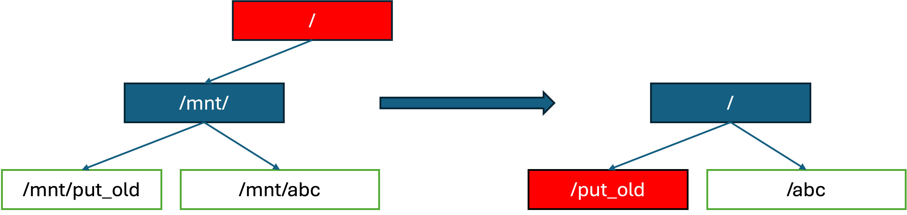

# Namespaces

## PID Namespaces
### Introduction
PID namespaces facilitate creation of an independent set of process IDs (PIDs) separated from other namespaces in such a manner that processes inside the child PID namespace are visible from the parent PID namespace but not vice versa. 

In order to put a newly created process in a separate pid namespace the system call unshare must be called prior to the fork. A parameter passed to the unshare system call  that indicates a PID namespace segregation is going to happen is a PID_NS. I.e., the unshare system call puts a calling process in the state of a namespace separation that will happen for the child process upon the actual call to the fork. The child forked after the call to unshare(PID_NS) function gets PID=1 in a newly created PID namespace and all it’s descendants will belong to that namespace. PID namespaces in xv6 do not support nesting.

If a process in a PID namespace is voluntarily or involuntarily terminated while having live descendants, they will be reparented to the process with PID=1. If the process with PID=1 dies, every other process in the pid namespace will be forcibly terminated and the namespace will be cleaned up.

### Usage example
Creating a new PID namespace is fairly easy as it can be observed from the practical use example below:
```c
// The unshare system call is used to create a new namespace for the child process.
if(unshare(PID_NS) != 0){
  printf(stderr, "Cannot create pid namespace\n");
  exit(1);
}
// Create a child process.
pid = fork();
if(pid == -1) {
  printf(stderr, "FAILURE: fork\n");
  exit(1);
}

// View the PIDs from the parent and child perspectives of the new process.
if(pid == 0)
  printf(stdout, "New namespace. PID=%d \n", getpid());
else
  printf(stdout, "Parent’s perspective on the child. PID=%d \n", pid);
```

Compiling and running the code snippet from above will result in the following output:
```
$ ./a
Parent’s perspective on the child. PID=4
New namespace. PID=1
```
This output demonstrates that the parent process sees the child process with PID=4, while the child process sees itself with PID=1. This is due to the fact that the child process is in a separate PID namespace, hence, the hirearchy of PIDs is different for the parent and the child, and because it has just been created (`unshare(PID_NS)`), it has PID=1 as the first process in the new namespace.


## Mount Namespaces
### Introduction
Mount namespaces facilitate an isolation of mount points. In order to achieve a mountpoint segregation the unshare system call with MOUNT_NS parameter must be called by the process that is inclined to have a separate (hidden from other processes) view on mount points. Descendants of that process are going to inherit that separated view preserving a mountpoint segregation.
### Usage example
Let’s see how new mount namespace is created from the practical use example below:
```c
static void createNwrite(char *path, char *str, int strlen) {
  int fd = 0;
  if ((fd = open(path, O_CREATE | O_RDWR)) <= 0) {
    printf(stderr, "open failed\n");
    exit(1);
  }

  if (write(fd, str, strlen) != 10) {
    printf(stderr, "write failed\n");
    exit(1);
  }
  close(fd);
}

int main() {
  // ******************************************************************************
  // create a child process with a separate mount namespace
  // create a mount point and mount on it a preformatted internal_fs_a
  // create a file on the mounted file system

  int pid = fork();
  if (pid < 0) {
    printf(stderr, "fork failed\n");
    exit(1);
  }

  if (pid == 0) {
    if (unshare(MOUNT_NS) != 0) {
      printf(stderr, "Cannot create mount namespace\n");
      exit(1);
    }

    if (mkdir("dirA") != 0) {
      printf(stderr, "mkdir failed\n");
      exit(1);
    }

    if (mount("internal_fs_a","dirA", 0) != 0) {
      printf(stderr, "mount failed\n");
      exit(1);
    }

    createNwrite("dirA / file.txt", "123456789\n", 10);
  }

  // ******************************************************************************

  // ******************************************************************************
  if (pid > 0) {
    // make sure child process runs first to create a new ns
    sleep(10000);

    // create a mount point and mount on it a preformatted internal_fs_b
    if (mkdir("dirB") != 0) {
            printf(stderr, "mkdir failed\n");
            exit(1);
    }

    if (mount("internal_fs_b","dirB", 0) != 0) {
            printf(stderr, "mount failed\n");
            exit(1);
    }

    createNwrite("dirB / file.txt", "987654321\n", 10);
  }

  // ******************************************************************************
  // both processes will sleep for a while to enable each
  // other to reach this point
  sleep(10000);

  // ******************************************************************************
  // at this point it is guaranteed that the child process is able to access
  // dirA/file.txt while the parent process is able to access dirB/file.txt but
  // not vice versa. We just need to check it.
  if (pid == 0) {
    if (open("dirA / file.txt", O_RDONLY) < 0) {
      printf(stderr, "open was about to succeed but failed\n");
      exit(1);
    }
    if (open("dirB / file.txt", O_RDONLY) >= 0) {
      printf(stderr, "open was about to fail but succeeded\n");
      exit(1);
    }
  } else {
    if (open("dirB / file.txt", O_RDONLY) < 0) {
      printf(stderr, "open was about to succeed but failed\n");
      exit(1);
    }
    if (open("dirA / file.txt", O_RDONLY) >= 0) {
      printf(stderr, "open was about to fail but succeeded\n");
      exit(1);
    }
  }

  exit(0);
}
```

Compiling and running the code snippet from above will create a mount namespace for a child process by unsharing it from the global mount namespace (`unshare(MOUNT_NS)`). 
Upon the namespace creation, the child process mounts the `internal_fs_a`, a device with a preformatted file system on it, on the `dirA` mountpoint. The parent process mounts the `internal_fs_b` device on `dirB` respectively. 

At this stage the root directory contains dirA and dirB subfolders. But only the child process is able to see the file.txt that was created on the internal_fs_a filesystem, while only the parent process is able to access the file.txt that was created on the internal_fs_b!

After the call to unshare we would have:
In the parent process -- the global (root) mount namespace, we will have the following structure:
* `/` --- disk mounted
  * `dirA`
  * `dirB` -- `internal_fs_b` mounted

But in the child process -- the new mount namespace, we will have the following structure:
* `/` --- disk mounted
  * `dirA` -- `internal_fs_a` mounted
  * `dirB`

1. The root directory "/" has been duplicated in the child process's mount namespace, so it's the same as in the parent process's mount namespace.
2. The parent only views the `dirB` directory, because the `internal_fs_b` filesystem is mounted from the parent, which is in the global mount namespace, but the child process is in a new mount namespace, so it doesn't see the `internal_fs_b` filesystem.
3. The same goes in the other direction, but with the `internal_fs_a` filesystem: the child process sees the `internal_fs_a` filesystem, but the parent process doesn't.

### Pivot root
The pivot_root system call has been implemented as part of the xv6 mount namespaces mechanism, and it is similar to the linux `pivot_root` system call, as explained in the [pivot_root(2) man page](https://man7.org/linux/man-pages/man2/pivot_root.2.html). In a nutshell, the purpose of the `pivot_root` syscall is to swap the filesystem root ("/") of a mount namespace to point at a new mount, different that the previous root mount, and put the old root in a mountpoint under the new one, as demonstrated in the following picture:



In the simple example above, each mount in the filesystem is a filled rectangle (in red and blue). The user calls for `pivot_root(/mnt/new_root, /mnt/new_root/put_old)`. The old root mount is moved to `/mnt/put_old` that becomes `/put_old`, since every path is rebased off from the `/mnt/` directory to `/`.

The system call performs this action atomically and safely for the entire namespace, as opposed to the `chroot` system call that does not provide a full isolation (as shown in tbhaxor's [blog post](https://tbhaxor.com/pivot-root-vs-chroot-for-containers/)).

The `pivot_root` syscall is a major part of the mount namespaces mechanism, that enables starting up containers with a different-than-the-original-root filesystem mount: both in docker and in pouch (the xv6 container creation utility), the `pivot_root` is called after the containers mount namespaces creation, to use the container's image as the root mount of the container's filesystem -- which is one of the fundamental features required for the isolation of a container from it's host system.

The pivot_root system call accepts too paths as arguments: `int pivot_root(const char* new_root, const char* put_old)`, Similarly to the linux one. The system call changes the root of the current mount namespace to point at the mount, which has it's path specified in `new_root` argument, and puts the old root mountpoint in the `put_old` location, that must be a subdirectory of the `new_root` mount (because it must be accessible when the system call ends). In any invalid argument case, the system call returns -1, and the error is printed to the console. Unit tests are implemented for the system call as part of the `mounttest` xv6 tests binary.

Usually, as the linux man mentioned as well, one would like to `chdir("/")` after performing the system call - so the old root can be `umount()`d and isolation is achieved. Since the entire operation is performed in a mount namespace, and as a part of the mount namespace mechnism, there should be no effect on any of the other mount namespaces. _Note_ that the pivot_root system call does not handle behavior when other processes are running in the same mount namespace -- the pivot_root caller must be aware of the possible consequences of the system call on other processes in the same mount namespace.