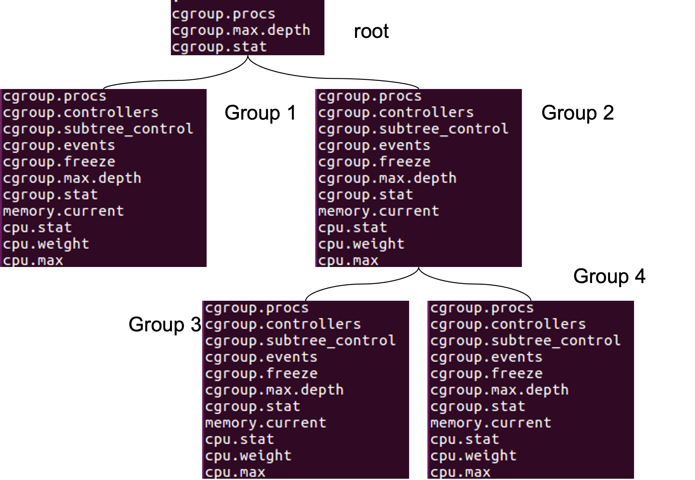

# cgroups
## Introduction
The cgroup mechanism in xv6 is a leaner version of it’s Linux counterpart that allows processes to be organized into hierarchical groups. Resource usage can be limited and monitored for each group of processes in the hierarchy. These groups are sometimes also called cgroups. Each group has several resource controllers also simply called controllers or sometimes referred as resource control subsystems which in turn are simply called subsystems. Controllers provide means to limit and account for different system resources and that's why they are also dubbed “subsystems”. 

## The cgroup interface
### Mounting the cgroup file system
The cgroup interface is provided through a pseudo-filesystem that in case of xv6 has to be mounted prior to its usage on a pre-created mount point:
```
$ mkdir cgroup
$ mount /cgroup -t cgroup
```

Prior to dismounting the cgroup file system it can be considered a best practice to change the cwd to somewhere outside. E.g:
```sh
$ cd /
$ umount /cgroups
```

### cgroup files
Files prefixed with “cgroup.” (e.g cgroup.stat) belong to the core part of the cgroup mechanism responsible for hierarchy organization. Files related to different subsystems start with a controller name: “cpu.”, “memory.” etc. The following table summarizes control and configuration options that xv6 core and subsystems supply. 
- W=Write specifies if the file can be written to.
- Root = Specifies if the file can be found in the root cgroup, and not only in subgroups.

#### cgroup core `cgroup.*`

| **File name** | Write | Root? |     |
| --- | --- | --- | --- |
| **cgroup.procs** | ✅   | ✅   | Contains the list of all the PIDs for the processes which belong to the cgroup that contains it is listed (see Pic 3). |
| **cgroup.controllers** | ❌   | ❌   | Contains a space-separated list of all controllers available to the cgroup. |
| **cgroup.subtree_control** | ✅   | ❌   | The file is empty when cgroup fs is mounted. A controller name prefixed with `+` or `-` can be written to the file in order to enable/disable controllers. When read, it shows a space separated list of the controllers which are enabled to the cgroup and all it’s descendants. |
| **cgroup.events** | ❌   | ❌   | Containers key-value pairs(In the form of `<KEY> <VALUE>\n`) providing state information about the cgroup:_populated -_ The value of this key is either 1, if this cgroup or any of its descendants has member processes, or otherwise 0. `frozen` - The value of this key is 1 if this cgroup is currently frozen, or 0 if it is not. |
| cgroup.freeze | ✅   | ❌   | Allowed values are `0` and  (`0` is the default). Writing  to the file causes freezing of the cgroup and all its descendants. From here, This means that all belonging processes will be stopped and will not run until the cgroup will be explicitly unfrozen. After freezing, the “frozen” value in the cgroup.events control file will be updated to .A cgroup can be frozen either by its own settings, or by the settings of any ancestor cgroups. If any ancestor cgroup is frozen, the cgroup will remain frozen. |
| **cgroup.max.descendants** | ✅   | ✅   | Contains a number indicating the maximum allowed amount of descendent cgroups. An attempt to create a new descendant cgroup in the hierarchy will fail if the hierarchy depth is going to exceed the maximum allowed amount of a descendent cgroups .This feature is not implemented (yet). |
| **cgroup.max.depth** | ✅   | ✅   | Contains a number indicating the maximum allowed amount of descendent cgroups under the current cgroup. An attempt to create a new descendant cgroup in the hierarchy will fail if the hierarchy depth is going to exceed it. This feature is not fully functional (yet). |
| **cgroup.stat** | ❌   | ✅   | Contains `nr_descendants` - the total number of descendant cgroups and `nr_dying_descendants` - the total number of dying descendant groups. A cgroup becomes dying after being deleted by a user. The cgroup will remain in a dying state for some undefined time (which can depend on system load) before being completely destroyed. |

#### CPU subsystem `cpu.*`
| **File name** | W   | Root |     |     |
| --- | --- | --- | --- | --- |
| **cpu.stat** | ❌   | ❌   |  This file exists if the cpu controller is enabled. It always reports the following three stats:-              `usage_usec`-              `user_usec`-              `system_usec` and the following three when the controller is enabled:-                 `nr_periods`-              `nr_throttled`-              `throttled_usec` |
| **cpu.weight** | ✅   | ❌   |  A parent's resource is distributed by adding up the weights of all active children and giving each the fraction matching the ratio of its weight against the sum. All weights are in the range \[1, 10000\] with the default at 100. |
| **cpu.max** | ✅   | ❌   |  A read-write file that exists in non-root cgroups. Contains 2 key-value entries: (`max`, `max_value`) and (`period`, `period_value`). The value of `max` indicates the maximal cpu time in microseconds that a group can consume during the time divided in periods indicated by the `period_value` (also measured in microseconds). Possible values that can be written to the file:-`max`, 100000 - no limit over the 100000 ms periods-              `max` - no limit over the previously specified period-              10000,20000 - limit the group to 50% of the CPU bandwidth |
| **cpuset.cpus** | ✅   | ❌   |  Limit the cgroup to a single cpu id. |

### Memory subsystem `memory.*`
***Note:*** The memory subsystem only supports subgroups -- no changes to the root cgroup are allowed.
| **File Name** | W   |     |
| --- | --- | --- |
| **memory.current** | ❌   | A read-only file that exists in non-root cgroups. It contains the total amount of memory currently being used by the cgroup and its descendants. |
| **memory.max** | ✅   | A read-write file that exists in non-root cgroups The default is the maximum amount of memory a userland process can have. Used to set a memory usage hard limit. If a cgroup’s memory usage reaches this limit processes that belong to the group will be denied from any additional memory allocation. Value of -1 removes the limit. |
| **memory.min** | ✅   | A read-write file that exists in non-root cgroups. The default value of 0 bytes, the minimum required memory required by this cgroup. When setting a value greater than 0 the sum of memory for all processes in this cgroup must have at least this amount of memory. |
| **memory.failcnt** | ❌   | Read only file that exist in non-root cgroups. The default value is 0. Specifies the number of times that the amount of memory used by a cgroup has risen to more than memory.max. |
| **memory.stat** | ❌   | A read-only flat-keyed file which exists on non-root cgroups.   This breaks down the cgroup's memory footprint into different types of memory, type-specific details, and other information on the state and past events of the memory management system.   All memory amounts are in bytes.   The entries are ordered to be human readable, and new entries can show up in the middle. Don't rely on items remaining in a fixed position; use the keys to look up specific values!   cache - # of bytes of page cache memory. mapped_file - # of bytes of mapped file (includes tmpfs/shmem) pgpgout - # of uncharging events to the memory cgroup. The uncharging event happens each time a page is unaccounted from the cgroup. swap - # of bytes of swap usage writeback - # of bytes of file that are queued for syncing to disk. inactive_file - # of bytes of file-backed memory on inactive LRU list. active_file - # of bytes of file-backed memory on active LRU list. unevictable - # of bytes of memory that cannot be reclaimed (mlocked etc). |
| **memory.swap.current** | ❌   | A read-only single value file which exists on non-root cgroups.   The total amount of swap currently being used by the cgroup and its descendants. |
| **memory.swap.max** | ✅   | A read-write single value file which exists on non-root cgroups. The default is "max".   Swap usage hard limit.  If a cgroup's swap usage reaches this limit, anonymous memory of the cgroup will not be swapped out. |

### IO subsystem `io.*`
***Note:*** The io subsystem only supports subgroups -- no changes to the root cgroup are allowed.
| **File Name** | W   |     |
| --- | --- | --- |
| **io.stat** | ❌   | A read-only file that exists in non-root cgroups. It contains the number of read and write io operations as well as the total read and written bytes performed by the cgroup and its descendants. The io.stat file has the following data:  ●      `rbytes` - number of bytes read ●      `wbytes` - number of bytes written ●      `rios` - number of read operations issued ●      `wios` - number of write operations issued Output example: `1:1 rbytes=31 wbytes=56 rios=32 wios=40` |
| **io.max** | ✅   | A read-write file that exists in non-root cgroups.  Allows to limit a cgroup's io usage by amount of io actions or by amount of bytes per second.  Example of expected format: `<dev_i>:<tty_i>,<order_1>=<num>,<order_2>=max` where order is one of: rbps,wbps,riops or wiops |

### cgroup hirearchy
cgroups form a tree structure and every process in the system belongs to one and only one cgroup. Upon a creation new processes tied to the same cgroup that the parent process belongs to. A process migration is allowed (to another cgroup) and it doesn't affect the process’ ancestors/descendants cgroup attachment. Subsystem controllers may be enabled or disabled for a cgroup. When a subsystem is enabled/disabled, it affects all processes that belong to the cgroups. Nested cgroups were added to xv6. Nested cgroup creation is performed by the mkdir command. Upon a nested cgroup creation files that are responsible for cgroup management (the core part) are created along with the subsystem controller files that were enabled in the parent cgroup. Changes in a parent cgroup affect (or may have an influence) on it’s descendant (nested) cgroups. 

Any change in memory of the parent cgroup will affect the child cgroup and vice versa. The cgroup implementation can handle any change and propagate it downwards or upwards (depending on the case).
For example, min/max recalculations. When the min memory limit of the child cgroup is changed all its ancestors will be affected and part of their memory will be “locked” for  the child.
Its important to state that in the above example, the child cgroup will succeed in setting the min memory only if there is an available memory for it (which is determined by its ancestors).

As can be seen in cgroup core and subsystem chapter, there are certain subsystem sub groups that are created inside non-root cgroups.



## cgroup usage
The easiest way to understand cgroups is through some practical use examples as described below. 
### Starting from a clean file system image
It is highly recommended to start from a clean file system since cgroup implementation has no full test coverage. 
From the host CLI:
```sh
# Delete old image
$ make clean
# Create a new image
$ make qemu-nox
```

Then, from the guest CLI, mount cgroup file system:
```sh
$ mkdir /cgroup
$ mount /cgroup -t cgroup
$ cd /cgroup
$ ls
```

The output should be:
```sh
.                                                                5 448
cgroup.procs                                                     4 6
cgroup.max.descendants                                           4 2
cgroup.max.depth                                                 4 2
cgroup.stat                                                      4 60
```

### Attaching a shell to newly created cgroup
```sh
# create an additional shell process, that will be attached to the new cgroup.
$ sh
$ cd cgroup
# observe processes attached to the root group: `init` (PID=1), `sh` (PID=2), new `sh` (PID=7)
# Note: PID=10 is the `cat` that is still attached to the cgroup as a `sh`(PID=2) child. 
$ cat cgroup.procs
1
2
8
10
# create a nested group `group1` under the root
$ mkdir group1
$ ls group1
.                                                                5 448
..                                                               5 512
cgroup.procs                                                     4 0
cgroup.controllers                                               4 6
cgroup.subtree_control                                           4 0
cgroup.events                                                    4 13
cgroup.freeze                                                    4 0
cgroup.max.descendants                                           4 2
cgroup.max.depth                                                 4 2
cgroup.stat                                                      4 60
memory.current                                                   4 21
cpu.stat                                                         4 0
memory.stat                                                      4 0
io.stat                                                          4 0
# observe that there is no process attached to the `group1` (empty cgroup.procs)
$ cd group1
$ cat cgroup.procs 
# attach new `sh` process (PID=7) to the `group1`
$ /ctrl_grp 7 cgroup.procs 
# observe that the new shell was attached + the `cat` process
$ cat cgroup.procs
7
19
# observe that the new shell (PID=7) was detached from the root cgroup (/cgroup)
$ cd ..
$ cat cgroup.procs
1
2
```

### Working with CPU controller
observe that cgroup.subtree_control is empty, hence, no controllers are enabled for the group1:
```sh
$ cd /cgroup/group1
$ cat cgroup.subtree_control # empty output.
```
As a follow up on the previous example, a cpu controller will be enabled for the group1 using the following command:
```sh
$ /ctrl_grp +cpu cgroup.subtree_control
```
Now, the group1 has a cpu controller enabled, so cgroup.subtree_control contains 'cpu', and new cpu control files are added to the cgroup:
```sh
$ cat cgroup.subtree_control
cpu
$ ls
.                                                                5 448
..                                                               5 512
cgroup.procs                                                     4 0
cgroup.controllers                                               4 6
cgroup.subtree_control                                           4 3
cgroup.events                                                    4 13
cgroup.freeze                                                    4 0
cgroup.max.descendants                                           4 2
cgroup.max.depth                                                 4 2
cgroup.stat                                                      4 60
memory.current                                                   4 21
cpu.stat                                                         4 0
memory.stat                                                      4 0
io.stat                                                          4 0
cpu.weight                                                       4 0
cpu.max                                                          4 0
```

Now, restrict the CPU usage of the group1 to 50% of the CPU time.

Observe what are the default values in cpu.max:
```sh
$ cat cpu.max
max - 4294967295
period - 100000
```
Configure all processes attached to the group1 to use CPU for 10000 out of every 20000 μs, which is 1/2 of the CPU time:
```sh
$ /ctrl_grp 10000,20000 cpu.max
$ cat cpu.max
max - 10000
period - 20000
```
Finally, disable the CPU controller for the group1:
```sh
$ /ctrl_grp -cpu cgroup.subtree_control
$ cat cgroup.subtree_control # empty output.
```
### Working with memory controller
To enable memory controller inside any non-root cgroup run the following command:
```sh
$ /ctrl_grp +mem cgroup.subtree_control
```
After memory controller enabled, list current directory to see new cgroup memory controller members:
```sh
$ cat cgroup.subtree_control
mem
$ ls
.                                                                5 448
..                                                               5 512
cgroup.procs                                                     4 0
cgroup.controllers                                               4 6
cgroup.subtree_control                                           4 0
cgroup.events                                                    4 13
cgroup.freeze                                                    4 0
cgroup.max.descendants                                           4 2
cgroup.max.depth                                                 4 2
cgroup.stat                                                      4 60
memory.current                                                   4 21
cpu.stat                                                         4 0
memory.stat                                                      4 0
io.stat                                                          4 0
memory.max                                                       4 0
memory.min                                                       4 0
```

To configure memory.max or memory.min use the following commands:
```sh
$ cat memory.min
0
$ cat memory.max
2147483648
$ ctrl_grp 1024 memory.min
$ ctrl_grp 131072 memory.max
$ cat memory.min
1024
$ cat memory.max
131072
```
Note that configuring min value will succeed only if the ancestor cgroups has enough space.
Also, setting the min value will affect  (if it succeeds) the ancestors by “locking” memory for the specific child.
The same is true regarding the max value - setting max value will limit the future child cgroups.
