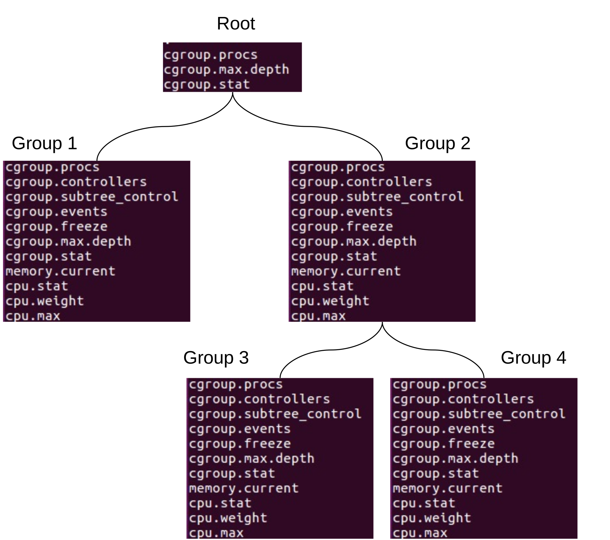
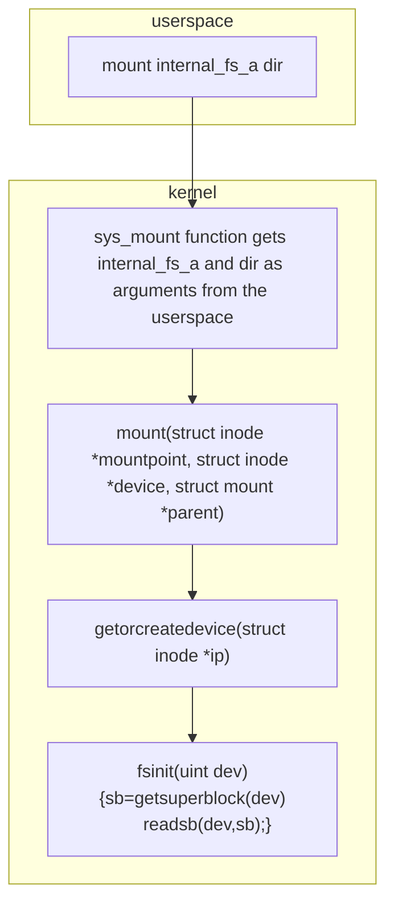

# cgroups

## Introduction

The cgroup mechanism in xv6 is a leaner version of it’s Linux counterpart that allows processes to be organized into hierarchical groups. Resource usage can be limited and monitored for each group of processes in the hierarchy. These groups are sometimes also called cgroups. Each group has several resource controllers also simply called controllers or sometimes referred as resource control subsystems which in turn are simply called subsystems. Controllers provide means to limit and account for different system resources and that's why they are also dubbed “subsystems”.

## The cgroup interface

### Mounting the cgroup file system

The cgroup interface is provided through a pseudo-filesystem that in case of xv6 has to be mounted prior to its usage on a pre-created mount point:

```
mkdir cgroup
mount /cgroup -t cgroup
```

Prior to dismounting the cgroup file system it can be considered a best practice to change the current working directory to somewhere outside. E.g:

```sh
cd /
umount /cgroups
```

### cgroup files

Files prefixed with `cgroup.*` (e.g cgroup.stat) belong to the core part of the cgroup mechanism responsible for hierarchy organization. Files related to different subsystems start with a controller name: `cpu.*`, `memory.*` etc. The following table summarizes control and configuration options that xv6 core and subsystems supply.

- W=Write specifies if the file can be written to.
- Root = Specifies if the file can be found in the root cgroup, and not only in subgroups.

#### cgroup core `cgroup.*`

| **File name** | Write | Root? |     |
| --- | --- | --- | --- |
| **`cgroup.procs`** | ✅   | ✅   | Contains the list of all the PIDs for the processes which belong to the cgroup that contains it is listed (see Pic 3). |
| **`cgroup.controllers`** | ❌   | ❌   | Contains a space-separated list of all controllers available to the cgroup. |
| **`cgroup.subtree_control`** | ✅   | ❌   | The file is empty when cgroup fs is mounted. A controller name prefixed with `+` or `-` can be written to the file in order to enable/disable controllers. When read, it shows a space separated list of the controllers which are enabled to the cgroup and all it’s descendants. |
| **`cgroup.events`** | ❌   | ❌   | Containers key-value pairs(In the form of `<KEY> <VALUE>\n`) providing state information about the cgroup:_populated -_ The value of this key is either 1, if this cgroup or any of its descendants has member processes, or otherwise 0. `frozen` - The value of this key is 1 if this cgroup is currently frozen, or 0 if it is not. |
| cgroup.freeze | ✅   | ❌   | Allowed values are `0` and  (`0` is the default). Writing  to the file causes freezing of the cgroup and all its descendants. From here, This means that all belonging processes will be stopped and will not run until the cgroup will be explicitly unfrozen. After freezing, the “frozen” value in the `cgroup.events` control file will be updated to .A cgroup can be frozen either by its own settings, or by the settings of any ancestor cgroups. If any ancestor cgroup is frozen, the cgroup will remain frozen. |
| **`cgroup.max.descendants`** | ✅   | ✅   | Contains a number indicating the maximum allowed amount of descendent cgroups. An attempt to create a new descendant cgroup in the hierarchy will fail if the hierarchy depth is going to exceed the maximum allowed amount of a descendent cgroups .This feature is not implemented (yet). |
| **`cgroup.max.depth`** | ✅   | ✅   | Contains a number indicating the maximum allowed amount of descendent cgroups under the current cgroup. An attempt to create a new descendant cgroup in the hierarchy will fail if the hierarchy depth is going to exceed it. This feature is not fully functional (yet). |
| **`cgroup.stat`** | ❌   | ✅   | Contains `nr_descendants` - the total number of descendant cgroups and `nr_dying_descendants` - the total number of dying descendant groups. A cgroup becomes dying after being deleted by a user. The cgroup will remain in a dying state for some undefined time (which can depend on system load) before being completely destroyed. |

#### CPU subsystem `cpu.*`

| **File name** | W   | Root |     |     |
| --- | --- | --- | --- | --- |
| **`cpu.stat`** | ❌   | ❌   |  This file exists if the cpu controller is enabled. It always reports the following three stats:-              `usage_usec`-              `user_usec`-              `system_usec` and the following three when the controller is enabled:-                 `nr_periods`-              `nr_throttled`-              `throttled_usec` |
| **`cpu.weight`** | ✅   | ❌   |  A parent's resource is distributed by adding up the weights of all active children and giving each the fraction matching the ratio of its weight against the sum. All weights are in the range \[1, 10000\] with the default at 100. |
| **`cpu.max`** | ✅   | ❌   |  A read-write file that exists in non-root cgroups. Contains 2 key-value entries: (`max`, `max_value`) and (`period`, `period_value`). The value of `max` indicates the maximal cpu time in microseconds that a group can consume during the time divided in periods indicated by the `period_value` (also measured in microseconds). Possible values that can be written to the file:-`max`, 100000 - no limit over the 100000 ms periods-              `max` - no limit over the previously specified period-              10000,20000 - limit the group to 50% of the CPU bandwidth |
| **`cpuset.cpus`** | ✅   | ❌   |  Limit the cgroup to a single cpu id. |

### Memory subsystem `memory.*`

***Note:**_ The memory subsystem only supports subgroups -- no changes to the root cgroup are allowed.

| **File Name** | W   |     |
| --- | --- | --- |
| **`memory.current`** | ❌   | A read-only file that exists in non-root cgroups. It contains the total amount of memory currently being used by the cgroup and its descendants. |
| **`memory.max`** | ✅   | A read-write file that exists in non-root cgroups The default is the maximum amount of memory a userland process can have. Used to set a memory usage hard limit. If a cgroup’s memory usage reaches this limit processes that belong to the group will be denied from any additional memory allocation. Value of -1 removes the limit. |
| **`memory.min`** | ✅   | A read-write file that exists in non-root cgroups. The default value of 0 bytes, the minimum required memory required by this cgroup. When setting a value greater than 0 the sum of memory for all processes in this cgroup must have at least this amount of memory. |
| **`memory.failcnt`** | ❌   | Read only file that exist in non-root cgroups. The default value is 0. Specifies the number of times that the amount of memory used by a cgroup has risen to more than memory.max. |
| **`memory.stat`** | ❌   | A read-only flat-keyed file which exists on non-root cgroups.  This breaks down the cgroup's memory footprint into different types of memory, type-specific details, and other information on the state and past events of the memory management system. All memory amounts are in bytes. The entries are ordered to be human readable, and new entries can show up in the middle. Don't rely on items remaining in a fixed position; use the keys to look up specific values! `cache` - # of bytes of page cache memory. `mapped_file` - # of bytes of mapped file (includes `tmpfs`/`shmem`) `pgpgout` - # of un-charging events to the memory cgroup. The un-charging event happens each time a page is un-accounted from the cgroup. `swap` - # of bytes of swap usage `writeback` - # of bytes of file that are queued for syncing to disk. inactive_file - # of bytes of file-backed memory on inactive LRU list. active_file - # of bytes of file-backed memory on active LRU list. `unevictable` - # of bytes of memory that cannot be reclaimed (`mlocked` etc). |
| **`memory.swap.current`** | ❌   | A read-only single value file which exists on non-root cgroups.   The total amount of swap currently being used by the cgroup and its descendants. |
| **`memory.swap.max`** | ✅   | A read-write single value file which exists on non-root cgroups. The default is "max".   Swap usage hard limit.  If a cgroup's swap usage reaches this limit, anonymous memory of the cgroup will not be swapped out. |

### IO subsystem `io.*`

***Note:**_ The io subsystem only supports subgroups -- no changes to the root cgroup are allowed.

| **File Name** | W   |     |
| --- | --- | --- |
| **`io.stat`** | ❌   | A read-only file that exists in non-root cgroups. It contains the number of read and write I/O operations as well as the total read and written bytes performed by the cgroup and its descendants. The `io.stat` file has the following data:  ●      `rbytes` - number of bytes read ●      `wbytes` - number of bytes written ●      `rios` - number of read operations issued ●      `wios` - number of write operations issued Output example: `1:1 rbytes=31 wbytes=56 rios=32 wios=40` |
| **`io.max`** | ✅   | A read-write file that exists in non-root cgroups.  Allows to limit a cgroup's I/O usage by amount of I/O actions or by amount of bytes per second.  Example of expected format: `<dev_i>:<tty_i>,<order_1>=<num>,<order_2>=max` where order is one of: `rbps`,`wbps`,`riops` or `wiops` |

### cgroup hierarchy

cgroups form a tree structure and every process in the system belongs to one and only one cgroup. Upon a creation new processes tied to the same cgroup that the parent process belongs to. A process migration is allowed (to another cgroup) and it doesn't affect the process’ ancestors/descendants cgroup attachment. Subsystem controllers may be enabled or disabled for a cgroup. When a subsystem is enabled/disabled, it affects all processes that belong to the cgroups. Nested cgroups were added to xv6. Nested cgroup creation is performed by the `mkdir` command. Upon a nested cgroup creation files that are responsible for cgroup management (the core part) are created along with the subsystem controller files that were enabled in the parent cgroup. Changes in a parent cgroup affect (or may have an influence) on it’s descendant (nested) cgroups.

Any change in memory of the parent cgroup will affect the child cgroup and vice versa. The cgroup implementation can handle any change and propagate it downwards or upwards (depending on the case).
For example, min/max recalculations. When the min memory limit of the child cgroup is changed all its ancestors will be affected and part of their memory will be “locked” for  the child.
Its important to state that in the above example, the child cgroup will succeed in setting the min memory only if there is an available memory for it (which is determined by its ancestors).

As can be seen in cgroup core and subsystem chapter, there are certain subsystem sub groups that are created inside non-root cgroups.



## cgroup usage

The easiest way to understand cgroups is through some practical use examples as described below.

### Starting from a clean file system image

It is highly recommended to start from a clean file system since cgroup implementation has no full test coverage.
From the host CLI:

```sh
# Delete old image
$ make clean
# Create a new image
$ make qemu-nox
```

Then, from the guest CLI, mount cgroup file system:

```sh
mkdir /cgroup
mount /cgroup -t cgroup
cd /cgroup
ls
```

The output should be:

```sh
.                                                                5 448
cgroup.procs                                                     4 6
cgroup.max.descendants                                           4 2
cgroup.max.depth                                                 4 2
cgroup.stat                                                      4 60
```

### Attaching a shell to newly created cgroup

```sh
# create an additional shell process, that will be attached to the new cgroup.
$ sh
$ cd cgroup
# observe processes attached to the root group: `init` (PID=1), `sh` (PID=2), new `sh` (PID=7)
# Note: PID=10 is the `cat` that is still attached to the cgroup as a `sh`(PID=2) child.
$ cat cgroup.procs
1
2
8
10
# create a nested group `group1` under the root
$ mkdir group1
$ ls group1
.                                                                5 448
..                                                               5 512
cgroup.procs                                                     4 0
cgroup.controllers                                               4 6
cgroup.subtree_control                                           4 0
cgroup.events                                                    4 13
cgroup.freeze                                                    4 0
cgroup.max.descendants                                           4 2
cgroup.max.depth                                                 4 2
cgroup.stat                                                      4 60
memory.current                                                   4 21
cpu.stat                                                         4 0
memory.stat                                                      4 0
io.stat                                                          4 0
# observe that there is no process attached to the `group1` (empty cgroup.procs)
$ cd group1
$ cat cgroup.procs
# attach new `sh` process (PID=7) to the `group1`
$ /ctrl_grp 7 cgroup.procs
# observe that the new shell was attached + the `cat` process
$ cat cgroup.procs
7
19
# observe that the new shell (PID=7) was detached from the root cgroup (/cgroup)
$ cd ..
$ cat cgroup.procs
1
2
```

### Working with CPU controller

observe that `cgroup.subtree_control` is empty, hence, no controllers are enabled for the group1:

```sh
cd /cgroup/group1
cat cgroup.subtree_control # empty output.
```

As a follow up on the previous example, a cpu controller will be enabled for the group1 using the following command:

```sh
/ctrl_grp +cpu cgroup.subtree_control
```

Now, the group1 has a cpu controller enabled, so `cgroup.subtree_control` contains 'cpu', and new cpu control files are added to the cgroup:

```sh
$ cat cgroup.subtree_control
cpu
$ ls
.                                                                5 448
..                                                               5 512
cgroup.procs                                                     4 0
cgroup.controllers                                               4 6
cgroup.subtree_control                                           4 3
cgroup.events                                                    4 13
cgroup.freeze                                                    4 0
cgroup.max.descendants                                           4 2
cgroup.max.depth                                                 4 2
cgroup.stat                                                      4 60
memory.current                                                   4 21
cpu.stat                                                         4 0
memory.stat                                                      4 0
io.stat                                                          4 0
cpu.weight                                                       4 0
cpu.max                                                          4 0
```

Now, restrict the CPU usage of the group1 to 50% of the CPU time.

Observe what are the default values in cpu.max:

```sh
$ cat cpu.max
max - 4294967295
period - 100000
```

Configure all processes attached to the group1 to use CPU for 10000 out of every 20000 micro-seconds, which is 1/2 of the CPU time:

```sh
$ /ctrl_grp 10000,20000 cpu.max
$ cat cpu.max
max - 10000
period - 20000
```

Finally, disable the CPU controller for the group1:

```sh
/ctrl_grp -cpu cgroup.subtree_control
cat cgroup.subtree_control # empty output.
```

### Working with memory controller

To enable memory controller inside any non-root cgroup run the following command:

```sh
/ctrl_grp +mem cgroup.subtree_control
```

After memory controller enabled, list current directory to see new cgroup memory controller members:

```sh
$ cat cgroup.subtree_control
mem
$ ls
.                                                                5 448
..                                                               5 512
cgroup.procs                                                     4 0
cgroup.controllers                                               4 6
cgroup.subtree_control                                           4 0
cgroup.events                                                    4 13
cgroup.freeze                                                    4 0
cgroup.max.descendants                                           4 2
cgroup.max.depth                                                 4 2
cgroup.stat                                                      4 60
memory.current                                                   4 21
cpu.stat                                                         4 0
memory.stat                                                      4 0
io.stat                                                          4 0
memory.max                                                       4 0
memory.min                                                       4 0
```

To configure memory.max or memory.min use the following commands:

```sh
$ cat memory.min
0
$ cat memory.max
2147483648
$ ctrl_grp 1024 memory.min
$ ctrl_grp 131072 memory.max
$ cat memory.min
1024
$ cat memory.max
131072
```

Note that configuring min value will succeed only if the ancestor cgroups has enough space.
Also, setting the min value will affect  (if it succeeds) the ancestors by “locking” memory for the specific child.
The same is true regarding the max value - setting max value will limit the future child cgroups.

## Technical (implementational) specification

### General

This chapter is devoted to the implementation details and is mainly related to the amendments required for C-type virtualization support in xv6 with an emphasis on the reasoning behind the modification made.

### pouch \- the command line tool for container management in xv6

#### tty devices

Upon xv6 boot 3 tty devices are created with mknod syscall. All devices are controlled by the same device driver and have a common major device number. The major number is the offset into the kernel’s device driver table, which tells the kernel what kind of device driver to use. The minor number tells the kernel special characteristics of the device to be accessed.
We can recognize each device by its major number (which identifies the driver and devices class) and by minor number which identifies the device itself. In other words every device driver is identified by ordered pair major:minor.

As it was mentioned already 3 tty devices were added. Tty devices are initialized in _main.c_ by _ttyinit()._

| ![NTTY=3 tty devices were added with same functionally as a console device][image20] | ![NTTY=3 tty devices were added with same functionally as a console device][image21] |
| :---- | :---- |
| Pic. 7 | Pic. 8 |

Pic. 7\. NTTY=3 tty devices were added with same functionally as a console device

ttywrite() and ttyread() functions are wrappers of the existing consoleread()/consolewrite() functions. They implement actual writing and reading to the user terminal for the tty that is active at the moment. ‘flags’ property added to ‘devsw’ to support different operations on tty devices.

Operations on tty devices were defined in fcntl.h and the corresponding functions are implemented in tty.c.

![tty operations][image22]

Pic. 8 tty operations

The ‘ioctl’ syscall was added to control tty devices allowing to connect / disconnect / attach / detach tty devices as long as to set/get their properties.

#### How the pouch utility manages containers

Containers in xv6 are identified by name (at least on this stage). The identifier _name_ is used for a container specification by (almost) all the commands that pouch utility supply.

Every container started with the pouch utility has a file /_name_ where the _name_ corresponds to the container identification string as it was specified at the container creation stage. The file holds which tty the container is attached to, and what is the PID of the process that forked the shell running inside the container. Additionally, tty.c{0\|1\|2} files specify a container identification string of the container that is tied to the corresponding tty device.

E.g. listing the files of the root (/) directory on xv6 right after the ‘pouch start myFirstContainer’ command is successfully completed reveals that a file named _myFirstContainer_ was created. The content of the _myFirstContainer_ affirms that the container is tied to the _tty0_ and the parent process ID that forked the shell inside the container is 5 (see Pic. 9). And tty.c0 contains the _myFirstContainer_ identification sting.

![tty.c0 and  /myFirstContainer files used by the pouch utility][image23]

Pic. 9 tty.c0 and  /myFirstContainer files used by the pouch utility

Processes running inside xv6 containers are organized by the pouch utility in a flat cgroup hierarchy.  Pouch mounts cgroup fs on the /cgroup mountpoint, creates a directory _/cgroup/name_ for a container identified by the _name_ identification string and takes advantage of the cgroups mechanism control means to allocate resources for the processes running inside the container. The directory is removed from the croup hierarchy when the container is destroyed. Pouch utility is limiting the container hierarchy to be flat i.e nesting is not supported. The layout of /cgroup is depicted on below in continuation of the previous example (myFirstcontainer):

![myFirstContainer related files under cgroup fs][image24]

Pic. 10 myFirstContainer related files under cgroup fs

#### pouch start

**pouch start** command translates to the pouch\_fork function in pouch.c. The table below describes the process of a container creation:

1. Find an available tty device. If `find_tty(tty_name)` fails, no more tty devices are available and no more containers can be created.
2. Check if a container with the same name is already running. Try to `open(container_name)`. If the operation succeeds, no container can be created (either a running container exists or a system cleanup is required).
3. Create a directory under /cgroup for the container using the `create_pouch_cgroup` function.
4. Update the tty.cN using `write_to_pconf` function.
5. Fork a child process that invokes a call to `unshare(PID_NS)` followed by another fork that will create an `sh` process inside the container. Attach a tty and replace the executable by calling `attach_tty(tty_fd)` and `exec("sh", argv)`.
6. Write the PID of the `sh` process to `cgroup.procs` in the corresponding cgroup to attach the process to the group.
7. Set up the mount namespace by calling `unshare(MOUNT_NS)`.
8. Finally, update the `/name` file where _name_ is the container identification string via the call to the `write_to_cconf` function.

Tab. 5 pouch\_fork described

#### pouch connect

**pouch connect** command simply translates to the call of the _connect\_tty_ function that eventually causes the appropriate _devsw_ device to be connected (and others be disconnected).

![mark devsw for the corresponding tty as connected][image25]

Pic. 11 mark devsw for the corresponding tty as connected

#### pouch disconnect

**pouch disconnect** command translates to the call of the _disconnect\_tty_ function that causes the _devsw[CONSOLE]_ to be connected back and disconnects the _devsw_ for the _tty_ that was associated with a container.

![mark devsw for the CONSOLE as connected][image26]

Pic. 12 mark devsw for the CONSOLE as connected

#### pouch destroy

**pouch destroy** command translates to several operations described below:

1. Attaching the process with the PID number obtained by the `read_from_cconf(container_name, ...)` call to the root cgroup (`/cgroup/cgroup.procs`) and terminating the process (`kill(pid)`).
2. Removing the `/container_name` file from the root directory.
3. Removing the directory corresponding to the container cgroup from the cgroup fs by calling `unlink(cg_cname)`.
4. Removing the container name from the corresponding `/tty.cN` file (the call to the `remove_from_pconf(tty_name)` function).
5. Finally, detaching the corresponding tty (the call to the `detach_tty(tty_fd)` function).
6. If `remove_from_pconf(tty_name) < 0` then return `-1`.

Tab. 6 pouch destroy described

#### pouch info

**pouch info** command can be invoked both in attached and detached stages. The command call translates to the _print\_cinfo_ function in pouch.c. The information is obtained according to the following description, where the _name_ stands for a container identification string.

| tty and pid | From /_name_ |
| :---- | :---- |
| cpu.max | From the _/cgroup/name/cpu.max_  |
| cpu.stat | From the /cgroup/name/cpu.stat |
| connected/disconnected | Based on the parent process ID |

Tab. 7 Source of information for ‘pouch info’ command

 Pouch info output for cccc container is illustrated below.

![Pouch info ][image27]

Pic 13\. Pouch info \- an example

#### pouch list

The **pouch list** command reads `tty.c{0|1|2}` files to obtain information about the running containers. It assumes that a container identification string for running containers is held by the `tty.cN` file. Although running containers belong to separate mount namespaces, they still share the root from the global mount namespace.

#### pouch cgroup

The **pouch cgroup** command translates to the `pouch_limit_cgroup` function in `pouch.c`. The table below describes how it works:

| Step | Description |
|:-----|:------------|
| 1    | Open `/name` where `name` stands for a container identification string. If `open` fails, print an error message indicating that there is no running container identified as `name`. |
| 2    | Open `/cgroup/name` (where `name` is a container identification string). |
| 3    | Write the limitation to the appropriate file under `/cgroup/name`. The limitation and the filename are passed as pouch cgroup command parameters. |

**Tab. 7 how pouch cgroup works**

For example, the command `pouch cgroup myFirstContainer cpu.max 10000,20000` translates to a write operation that puts `10000,20000` into `/cgroup/myFirstContainer/cpu.max`. The command `pouch cgroup myFirstContainer cpu.weight 50` translates to a write operation that puts `50` into `/cgroup/myFirstContainer/cpu.weight`. Note that according to the functional specification of the cgroup mechanism, `cpu.max` and `cpu.weight` files appear only if the `cpu` controller is enabled. The function `create_pouch_cgroup` enables the CPU controller for every container launched by the pouch utility.

### namespaces in xv6

Namespaces implementation in xv6 resembles how they are implemented in Linux. The xv6 counterpart of Linux’s `task_struct`, the `proc`, holds a pointer to the namespace proxy object `struct nsproxy *nsproxy` containing references to the namespaces that the respective process belongs to:

![_struct proc_ (proc.h)][image28]

![_struct nsproxy_][image29]

Pic. 14 _struct proc_ (proc.h) and _struct nsproxy_ (namespace.h)

xv6 has an upper limit of `NNAMESPACE` namespaces that can be created in the system. The global `namespacetable` (defined in `namespace.c`) holds the information of all the xv6 namespaces. Access to the `namespacetable` is secured by a spinlock. `struct nsproxy` contains a reference counter and points to `struct mount_ns` and `struct pid_ns`.

Pic. 15 namespaces data structures in xv6

#### PID namespaces in xv6

New PID namespace is created by the `unshare(PID_NS)` system call. The calling process has a new PID namespace for its children which is not shared with any previously existing process. The calling process is not moved into the new namespace. The first child created by the calling process will have the process ID 1 and will assume the role of [init](https://man7.org/linux/man-pages/man1/init.1.html) process in the new namespace. The pseudocode of `unshare` function is:

1. Reserve a row for a new namespace in the global `namespacetable` using `allocnsproxyinternal` function. If the number of namespaces exceeds `NNAMESPACE`, the call results in `ENOMEM`.
2. Increase the reference count of the `mount_ns` and `pid_ns` structs. Note that `myproc()->nsproxy` points to the same namespaces (just increased the count).
3. Reserve a new pid namespace (`pid_ns_new` function) and update the `myproc()->child_pid_ns` field to ensure that all calling process children will execute in a newly created namespace.

Tab. 8 how unshare works for PID ns

The _pid\_ns\_new_ function reserves a row in a _pidnstable_ (pid\_ns.c). Actually all pid\_ns structs are preallocated and as Pic 15 depicts, nsproxy[i] simply holds a pointer to the specific row in a global _pidnstable_.

To complete the picture changes required in _fork, kill_ and _wait_ functions that  become pid namespace aware need to be mentioned. _kill_ and _wait_ will only operate using the pid that is visible in the namespace. _fork_, will create a new process as a PID namespace leader (init role) if _myproc()-\>child\_pid\_ns_ is set by the _unshare_ system call prior to _fork_.

##### fork

Changes required in _fork_ are related to the implementation of process ID mapping. xv6 PID namespaces implement the support of up to 4 nested namespaces. The `struct pid_entry pids[4]` field in a per-process state describes the mapping. Let’s reveal how nesting is implemented based on the following example:

![Another level of a nested namespace (reiterated based on Pic1)][image30]

Pic 16. Another level of a nested namespace (reiterated based on Pic1)

As one can observe, process IDs in the third namespace start from PID=1. However, for the namespace at the second level it is known as a PID=4, while in the parent PID namespace it holds PID=11. Pic. 16 describes how the array `pids[4]` of `struct pid_entry` is holding the numbers.

Pic 16. How `struct pid_entry pids` is used to implement nested PID namespaces system call

To make _fork_ PID namespaces aware, the following changes were introduced (red color is used to indicate completely new code, orange color is used for partially overlapped lines):

| xv6-public _fork -_ pseudocode | PID namespace aware _fork -_ pseudocode |
| :----------------------------- | :-------------------------------------- |
| Set `struct proc current` to point the current process Allocate process with `allocproc` for a child Copy process state from proc. Given a parent process's page table, create a copy of it for a child. Update a parent process, state and stack for a child process. Clear %eax so that fork returns 0 in the child. For every open file in the parent process Increment ref count using `filedup` Update `cwd` inode for a new process using `idup` Copy parent’s `name[16]` to the child’s proc `struct proc` using `safestrcpy` (`name` is used for debugging purposes only) Set `pid` to be `np->pid`  Update `np->state` to be `RUNNABLE` (`ptable.lock` has to be acquired) Return `pid` | Fail if `curproc->child_pid_ns && curproc->child_pid_ns->pid1_ns_killed` Check if cgroup limit was reached when pid controller is enabled Check if cgroup reached its memory limit when memory controller is enabled Set `struct proc current` to point the current process Allocate process with `allocproc` for a child Copy process state from proc. Given a parent process's page table, create a copy of it for a child. Update a parent process, state and stack for a child process. Clear %eax so that fork returns 0 in the child. For every open file in the parent process Increment ref count using `filedup` Update `cwd` inode for a new process using `idup` Copy `cwdp` from the parent using `safestrcpy` Increase reference to the `curproc->cwdmount` using `mntdup` Update `np->nsproxy` For each one of `MAX_PID_NS_DEPTH pid_ns` update the corresponding pid (see pic 16) Copy parent’s `name[16]` to the child’s proc `struct proc` using `safestrcpy` (`name` is used for debugging purposes only) Set `pid` according to the namespace using `get_pid_for_ns` Update `np->state` to be `RUNNABLE` (`ptable.lock` has to be acquired) Return `pid` |

#### Mount namespaces in xv6

Mount namespaces facilitate an isolation of mount points. New mount namespace is created by the `unshare(MOUNT_NS)` system call. The calling process has a new mount namespace for its children which is not shared with any previously existing process. To handle mount namespaces, the pseudocode of the `unshare` function described in Tab 8 is amended with the following step:

| mount ns amendment to the unshare system call |
| :-------------------------------------------- |
| Create a new mount namespace (`copymount_ns` function) and update the `myproc()->nsproxy->mount_ns` field to ensure the calling process has a segregated view on mountpoints.|

Tab. 9 mount ns amendment to the unshare system call

The `copymount_ns` function reserves a row in a `mountnstable` (mount_ns.c). Actually, all `mount_ns` structs are preallocated and as Pic 15 depicts, `nsproxy[i]` simply holds a pointer to the specific row in a global `mountnstable`.

##### Mountpoint related structures in xv6

Mount namesapces in xv6 are preallocated and accessible via the global _mountnstable:_

```c
# define NNAMESPACE 20 // maximum number of namespaces
struct {
   struct spinlock lock;
   struct mount_ns mount_ns[NNAMESPACE];
} mountnstable;
```

The following diagram depicts what happens in the xv6 kernel when the command line _mount_ utility call is issued on a preformatted file system.



Pic 17\. Mount system call trace[^2]

_fsinit_ method results in reading a superblock from a device to a preallocated slot of superblocks.

```c
#define NLOOPDEVS (10)
#define NIDEDEVS (2)

struct device {
   int superblock sb;
   int ref;
   struct inode *ip;
};

struct {
   struct spinlock lock;
   struct device loopdevs[NLOOPDEVS];
   struct device idedevs[NIDEDEVS];
} dev_holder;
```

Pic 18\. xv6 supports up to NIDEDEVS IDE devices and up to NLOOPDEVS loopback devices (preformatted internal\_fs\_a/b/c file can mounted as a block device)

### cgroup in xv6

#### memory.max

Configuration available in a non-root cgroup. After cgroup memory controller was enabled, “memory.max” will be available. This limit value stores an integer number which represents the maximum number of bytes that processes under this parent cgroup and all its children can get.
When a process moves to a cgroup with memory maximum definition and this process memory size is greater than memory.max, throw an error and do not proceed.
When a process that is inside a cgroup with memory maximum definition is being forked, check if a summary together with this new process memory size grows over the memory.max. Then it throws an error and aborts fork operation.
When a process tries to grow its memory, test for memory maximum configuration. When the new memory size of the process grows over memory.max abort with an error.
Value of \-1 will remove the limit of memory.max.

#### memory.min

Configuration available in a non-root cgroup. After cgroup memory controller was enabled, “memory.min” will be available. This limit value stores an integer number which represents the minimum number of bytes that processes under this parent cgroup and all its children can get.
When adding a new process with smaller size than memory.min, grow this new process memory size to match the memory minimum number of bytes.
When a process is being killed, check if the memory size of a cgroup processes and its children processes is lower than defined in memory.min. When it is lower, calculate the difference and appen this difference divided by the number of all processes in cgroup parent and its children.

#### memory.failcnt

Configuration available in a non-root cgroup. After cgroup memory controller was enabled, “memory.failcnt” will be available. This counter increments every time a process tries to allocate more memory than the memory.max limit.
