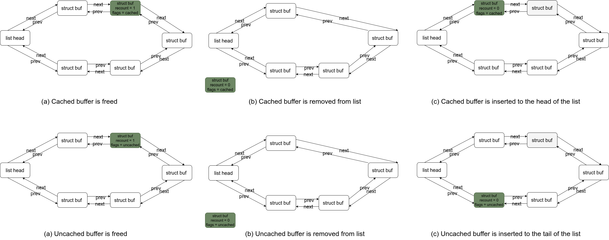

# Unified FS Cache System

## Overview

Our solution introduces a unified approach to file system caching by using a fixed-size buffer cache also for the objfs caching. This approach consolidates the buffer allocation and caching management into a single module, which utilizes a single Most Recently Used (MRU) list as its caching algorithm.  
In this solution, complete objects are read into multiple buffers (based on their size, using as many buffers as required). However, only those buffers containing the region of interest, and their surrounding buffers (known as padding) are cached after they are freed. The remaining buffers are added to the tail of the MRU list, making them eligible for eviction in favor of more useful buffers.  
Since this caching mechanism closely resembles the caching system used in nativefs, it allows us to avoid code duplication by integrating the caching systems into a single file-system-agnostic buffer cache. This unified cache system can manage buffers from different file systems together.

## Improvements
This solution addresses the following issues identified in the previous caching system as follows:

### Uncacheable Big Objects  
  All objects are now cached, but only the regions of interest are retained in the cache. This ensures that even large objects benefit from caching, improving performance for frequently accessed regions.

### Inefficient Use of Cache Memory  
  The cache unit sizes are decent, and only the last buffer of an object might be fully used, reducing the overall wasted cache memory to neglectable amount.

### Objfs Buffers Duplications  
  Dynamic memory allocations are eliminated; instead, buffers are allocated statically. Additionally, memory copies are minimized to essential transfers between user space and kernel space, reducing overhead and improving efficiency.

### Non-Dynamic Usage of Memory  
  By employing a single file-system-agnostic buffer cache system shared by all file systems, cache memory is allocated based on demand. In scenarios where one file system is heavily used, it can utilize the entire cache memory, thereby optimizing resource use.

## Nogoals

The following features, while potentially beneficial for enhancing file system caching, are not implemented in this project. These omissions are primarily due to a desire to stand in the project scope and implementation time. Furthermore, we want to maintain simplicity—considering XV6 is an educational system.

### Improved Caching Algorithms
Currently, we use a single Most Recently Used (MRU) list for managing the cache. When a buffer that should not be cached is freed, it is added to the tail of this MRU list. An improved algorithm could utilize two MRU lists: one for cached buffers and one for non-cached buffers. Upon freeing a buffer, it would be added to the head of its corresponding list. Allocation of a new buffer would first attempt to evict from the non-cached list and only search the cached list if necessary. This approach would introduce order among non-cached buffers.

As the cache system is shared among all file systems, the number of cache entries increases, potentially lengthening search times for specific buffers. An enhanced approach would involve maintaining a hash table of all buffers, with the buffer block number as the key. This would significantly improve search efficiency.

### Dynamic Cache Entries Allocation
Our solution employs a fixed-size array of cache entries allocated at compile time. This static allocation limits flexibility; when few buffers are used, the static memory could be better utilized for other purposes, whereas it may be insufficient when a large number of buffers are needed. A more adaptable solution would involve dynamically allocating and freeing buffers within certain limits or based on overall kernel memory demands.

### Realistic Object Storage Device Emulation
A more realistic emulation of object storage devices could be valuable for performance measurement of both the cache system and other objfs modules. Such an emulation would involve response delays and interrupt notifications when operations are complete, necessitating kernel sleep operations and careful lock management. While our cache system lays the groundwork for this type of emulation with a ‘dirty’ flag for buffers not yet written to disk, the current implementation does not include these features. Future enhancements could enable the disk layer to handle delayed responses and more accurately emulate real device behavior.
