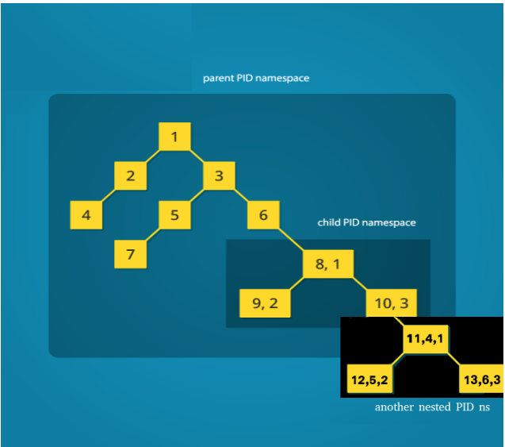
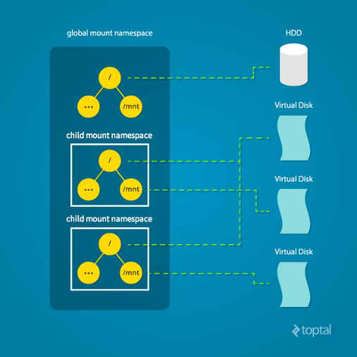
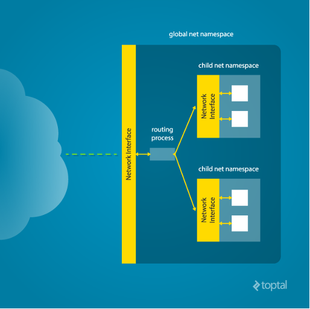
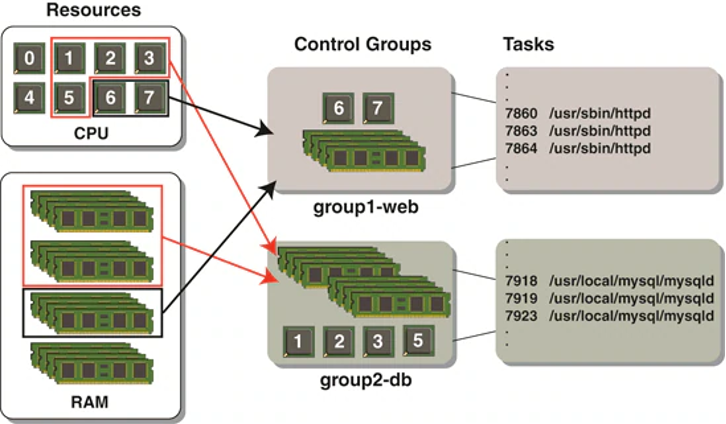
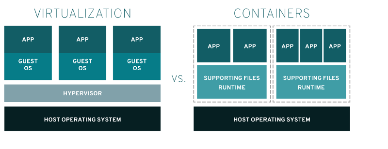

# How containers are implemented in Linux

A Linux container is a set of 1 or more processes isolated from the rest of the system. It provides resource management through control groups and resource isolation via namespaces.

Linux kernel has several types of namespaces and each of them may be considered to be a kernel feature. Let’s examine them one by one.  

## PID namespaces
Provide processes with an independent set of process IDs (PIDs) separated from other namespaces. Processes inside the child PID namespace are visible from the parent PID namespace. The process with PID 8 is a direct descendant of the process with PID 6\. But inside the child PID namespace they are organized in a ‘parallel’ hierarchy. The process with the PID 8 is the `init` process inside that parallel universe and, therefore, referred to as a process with PID 1\. Processes with PIDs 1-3 in the child PID namespace have no knowledge of other processes' existence while the parent PID namespace processes retain the visibility on the processes with PIDs 8-10.

Pic 1 (from ‘[Separation Anxiety: A Tutorial for Isolating Your System with Linux Namespaces](https://www.toptal.com/linux/separation-anxiety-isolating-your-system-with-linux-namespaces)’)

## Mount namespaces 
isolate and control mount points. Global mount points view can be altered by children mount namespaces. As depicted below, the first and second child namespaces refer to the same virtual disk where their root filesystem is located, which is different from the root filesystem visible from the global (initial) mount namespace. In addition, children mount namespaces refer to different filesystems mounted on their respective `/mnt` mount points, therefore providing an individual view of the tree hierarchy for them.

Pic 2 (from ‘[Separation Anxiety: A Tutorial for Isolating Your System with Linux Namespaces](https://www.toptal.com/linux/separation-anxiety-isolating-your-system-with-linux-namespaces)’)

## Network namespaces 
Isolates system networking resources. Global networking resources view is altered by the child net namespaces and processes in those namespaces are bestowed with a (presumingly) different set of network interfaces.  

Pic 3 (from ‘[Separation Anxiety: A Tutorial for Isolating Your System with Linux Namespaces](https://www.toptal.com/linux/separation-anxiety-isolating-your-system-with-linux-namespaces)’)

Additional namespaces exhibited by Linux include:

## Other namespaces
- **UTS namespaces** - to isolate host and  domain names, meaning that different processes may appear as running on different hosts and domains while running on the same system. 
- **IPC namespaces** - to isolate inter-process communications. E.g. processes in different IPC namespaces will be able to use the same identifiers for a shared memory region and produce two such distinct regions.
- **User namespaces** - to isolate user and group ID spaces. This namespace is found useful when one needs to have the root user with ID 0 inside the namespace while the actual user ID for that user in the global namespace differs from 0\.
- **Time namespace** - to isolate machine time, allowing processes in different time namespaces to see different system times.

## Control groups (cgroups)
All the namespaces mentioned so far provide different means of resource isolation, but unless inclined to grant an unlimited amount of system resources to the processes that utilize the namespace segregation, resource accounting and limitation is required. Therefore, Linux kernel is featured with a **cgroup** mechanism providing limiting, prioritization, accounting and control features with regard to a collection of processes:

**Resource limiting** - group of processes can be set to not exceed CPU, memory, disk I/O, network limits.                

**Prioritization** - some process groups may get a larger share of resources than others.

**Accounting -** measures a group's resource usage. 

**Control -** facilitates freezing, check-pointing and restarting of groups of processes.

Pic 4 ([Resources allocated to the group1-web and groups2-db cgroups and associated sets of processes](https://www.oracle.com/technical-resources/articles/linux/resource-controllers-linux.html))

Control groups and resource isolation via namespaces empower isolation of processes and facilitate creation of **containers**. Containers belong to the type of virtualization also known as a ‘system level virtualization’. This type of virtualization is also called a C-type virtualization (C stands for ‘Container’). While VMs (Virtual Machines) running on top of hypervisors provide higher security level at the expense of heavier resource consumption and (to some extent) slower performance, the system level virtualization is much more lightweight (resource wise) while sacrificing several security aspects as a trade-off. 

Pic 5 (from ‘[What is a Linux container](https://www.redhat.com/en/topics/containers/whats-a-linux-container)’)

## Sources and other learning resources
1. cgroups(7) — Linux manual page <https://man7.org/linux/man-pages/man7/cgroups.7.html>
2. cgroupv2: Linux's new unified control group hierarchy (QCON London 2017) <https://www.youtube.com/watch?v=ikZ8_mRotT4>
3. Containerization Mechanisms: Cgroups <https://blog.selectel.com/containerization-mechanisms-cgroups/>
4. Containerization Mechanisms: Namespaces <https://blog.selectel.com/containerization-mechanisms-namespaces/>
5. Control Group v2 <https://www.kernel.org/doc/Documentation/cgroup-v2.txt>
6. RELATIONSHIPS BETWEEN SUBSYSTEMS, HIERARCHIES, CONTROL GROUPS AND TASKS <https://access.redhat.com/documentation/en-us/red_hat_enterprise_linux/6/html/resource_management_guide/sec-relationships_between_subsystems_hierarchies_control_groups_and_tasks>
7. <https://stackoverflow.com/questions/49971604/how-does-xv6-write-to-the-terminal>
8. Linux Insides - Gitbook <https://0xax.gitbooks.io/linux-insides/content/>
9. cgroups - Memory Controller <https://facebookmicrosites.github.io/cgroup2/docs/memory-controller.html>
10. Elixire Bootlin -- cgroups Memory Controller and tests
<https://elixir.bootlin.com/linux/v4.0.9/source/Documentation/cgroups/memory.txt>
<https://elixir.bootlin.com/linux/v4.0.9/source/Documentation/cgroups/memcg_test.txt>
11. LWN mailing about cgroups Memory Controller development <https://lwn.net/Articles/206697/>
12. cgroups - CPU Controller <https://www.kernel.org/doc/html/v5.4/admin-guide/cgroup-v2.html#cpu>
