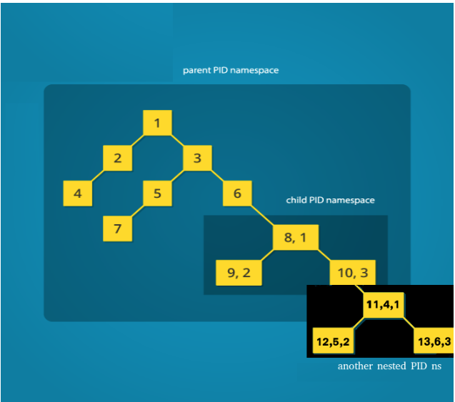

# Namespaces

## Namespaces - Preface
Namespaces implementation in xv6 resembles the way they are implemented in Linux. The xv6 counterpart of  Linux’s task_struct the proc holds a pointer to the namespace proxy object struct nsproxy *nsproxy containing references to the namespaces that the respective process belongs to:

```c
// Per-process state
struct proc {
  uint sz;               // Size of process memory (bytes)
  pde_t *pgdir;          // Page table
  char *kstack;          // Bottom of kernel stack for this process
  enum procstate state;  // Process state
  // int pid;
  int ns_pid;  // Process ID
  struct pid_entry pids[4];
  struct proc *parent;             // Parent process
  struct trapframe *tf;            // Trap frame for current syscall
  struct context *context;         // swtch() here to run process
  void *chan;                      // If non-zero, sleeping on chan
  int killed;                      // If non-zero, have been killed
  struct vfs_file *ofile[NOFILE];  // Open files
  struct vfs_inode *cwd;           // Current directory
  struct mount *cwdmount;          // Mount in which current directory lies
  char name[16];                   // Process name (debugging)
  struct nsproxy *nsproxy;         // Namespace proxy object
  struct pid_ns *child_pid_ns;     // PID namespace for child procs
  int status;                      // Process exit status
  char cwdp[MAX_PATH_LENGTH];      // Current directory path.
  struct cgroup *cgroup;           // The process control group.
  unsigned int cpu_time;           // Process cpu time.
  unsigned int cpu_period_time;    // Cpu time in microseconds in the last
                                   // accounting frame.
  unsigned int
      cpu_percent;  // Cpu usage percentage in the last accounting frame.
  unsigned int cpu_account_frame;  // The cpu account frame.
};

struct nsproxy {
  int ref;
  struct mount_ns* mount_ns;
  struct pid_ns* pid_ns;
};
```

xv6 has an upper limit of NNAMESPACE namespaces that can be created in the system.  The global namespacetable (defined in namespace.c) holds the information of all the xv6 namespaces. Access to the namespacetable is secured by a spinlock. struct nsproxy contains a reference counter and points to struct mount_ns and struct pis_ns. 

## PID Namespaces
New PID namespace is created by the unshare(PID_NS) system call. The calling process has a new PID namespace for its children which is not shared with any previously existing process. The calling process is not moved into the new namespace.  The first child created by the calling process will have the process ID 1 and will assume the role of init process in the new namespace. The pseudocode of unshare function is: 
- Reserve a row for a new namespace in the global namespacetable using allocnsproxyinternal function. If the number of namespaces exceeds NNAMESPACE the call results in ENOMEM[^1].
- Increase the reference count of the mount_ns and pid_ns structs. Note that myproc()->nsproxy points to the same namespaces (just increased the count).
- Reserve a new pid namespace (pid_ns_new function) and update the myproc()->child_pid_ns field to ensure that all calling process children will execute in a newly created namespace.

The pid_ns_new function reserves a row in a pidnstable (pid_ns.c). Actually all pid_ns structs are preallocated and as Pic 15 depicts, nsproxy[i] simply holds a pointer to the specific row in a global pidnstable. 

To complete the picture changes required in fork, kill and wait functions that  become pid namespace aware need to be mentioned. kill and wait will only operate using the pid that is visible in the namespace. fork, will create a new process as a PID namespace leader (init role) if myproc()->child_pid_ns is set by the unshare system call prior to fork.

### fork
fork 
Changes required in fork are related to the implementation of process ID mapping. xv6 PID namespaces implement the support of up to 4 nested namespaces. struct pid_entry pids[4] field in a per-process state describes the mapping. Let’s reveal how nesting is implemented based on the following example:


As one can observe, process IDs in the third namespace start from PID=1. However, for the namespace at the second level it is known as a PID=4, while in the parent PID namespace it holds PID= 11. Pic. 16 describes how the array pids[4] of struct pid_entry is holding the numbers. 


To make fork PID namespaces aware the following changes were introduced (bold font is used to indicate completely new code, italic is used for partially overlapped lines):

#### xv6-public fork - pseudocode
- Set struct proc current to point the current process
- Allocate process with allocproc for a child
- Copy process state from proc. Given a parent process's page table, create a copy of it for a child. Update a parent process, state and stack for a child process.
- Clear %eax so that fork returns 0 in the child.
- For every open file in the parent process Increment ref count using filedup
- Update cwd inode for a new process using idup 
- Copy parent’s name[16] to the child’s proc struct proc using safestrcpy (name is used for debugging purposes only)
- *Set pid to be np->pid* 
- Update np->state to be RUNNABLE (ptable.lock has to be acquired)
- Return pid 

#### PID namespace aware fork - pseudocode
 - **Fail if curproc->child_pid_ns && curproc->child_pid_ns->pid1_ns_killed**
- **Check if cgroup limit was reached when pid controller is enabled**
- **Check if cgroup reached its memory limit when memory controller is enabled**
- Set struct proc current to point the current process
- Allocate process with allocproc for a child
- Copy process state from proc. Given a parent process's page table, create a copy of it for a child. Update a parent process, state and stack for a child process.
- Clear %eax so that fork returns 0 in the child.
- For every open file in the parent process Increment ref count using filedup
- Update cwd inode for a new process using idup
- **Copy cwdp from the parent using safestrcpy**
- **Increase reference to the curproc->cwdmount using mntdup**
- **Update np->nsproxy**
- **For each one of MAX_PID_NS_DEPTH pid_ns update the corresponding pid (see pic 16)**
- Copy parent’s name[16] to the child’s proc struct proc using safestrcpy (name is used for debugging purposes only)
- *Set pid according to the namespace using get_pid_for_ns*
- Update np->state to be RUNNABLE (ptable.lock has to be acquired)
- Return pid

## Mount Namespaces
Mount namespaces facilitate an isolation of mount points. Each `mount()` and `umount()` calls performed in a creatin namespace, do not effect any of the mounts in the other namespaces.

All the mount namespaces are held in the global `mountnstable` struct, that is defined in `mount_ns.c` as follows:
```c
#define NNAMESPACE 20

struct {
  struct spinlock lock;
  struct mount_ns mount_ns[NNAMESPACE];
} mountnstable;
```

A mount namespace in xv6 is defined using the following struct:
```c
struct mount_ns {
  int ref;
  struct spinlock lock;  // protects active_mounts and root.
  struct mount* root;
  struct mount_list* active_mounts;
};
```

- The `root` field is held to enable the `pivot_root` functionallity, that is explained later.
- The `active_mounts` field is a pointer to a linked list of `strutc mount_list`, that contain `struct mount` in them, which describes the current mounts applicable for the current namespace. Those are never shared between different mount namespaces -- once a mount namespace is created, it's mounts are deep-copied from the old namespace.

A simple diagram that shows the structure of the mount namespaces table in xv6:


The first ("root") mount namespace is created from the kernel `main()` function, by calling the `namespaceinit()` function, that calls the `mount_nsinit` function. 
The `mount_nsinit` function only allocates a new mount namespace, that is always the first one to be used in the system, for the init process, and therefore it is the root mount namespace. It is assumed that the root mount namespace lives through the entire system up time, and that it is always the first mount namespace to be created, in the `mountnstable->mountns[0]` item (as `get_root_mount_ns()` implements it, too). The root mount namespace is then used when mounting the root filesystem (that is explained later), and when calling the `initnsproxy()` function, that creates the `nsproxy` struct for the init process (via `userinit` -- init process creation).
It is important to start the root mount namespace in the kernel init, before starting any other filesystem-related mechanism (such as mounts and devices), because there has to be a mount namespace for each mount to be associated with on it's creation, as each `struct mount` is held uniquely by a mount namespace's `active_mounts`, always.

### New mount namespace creation
New mount namespace is created by the `unshare(MOUNT_NS)` system call. The calling process has a new mount namespace for its children which is not shared with any previously existing process. To handle mount namespaces the pseudocode of the `unshare` function described earlier. is amended with the following step:

1. A new mount namespace is allocated from the `mountnstable` (defined in `mount_ns.c`), using `allocmount_ns()`.
2. The new mount namespace is populated with a deep copy of the current mount namespace's mounts list, performed by `copyactivemounts()`:
    - `shallowcopyactivemounts()` allocates a new `struct mount` to be used in the new mount namespace, for each existing `struct mount` in the current mount namespace. It leaves the parent mounts of each mount as null.
    - `fixparents()` fills the nulled parent value of each new `struct mount` allocated in the previous step -- this is done by iterating the old mounts list hirearchy and the new mounts list hirearchy in parallel, and once a parent is found in the old namespace for the old mount, the matching parent in the new mount namespace is set to the mount in the mount namespace.
    - The current process `cwdmount` is updated to be the matching new mount in the new namespace that has just been created.
3. The new mount namespace root is set as the new root mount struct in the new namespace that we have just created.
4. Finally, the new mount namespace is set into the `myproc()->nsproxy->mount_ns` field, and the old namespace is de-refd.

### pivot_root
The core implementation of `pivot_root` is found in the `mount_ns->root` field, shown above in the mount namespaces structure definition. When calling the `pivot_root` system call, it looks up the inodes for the `new_root` and `put_old` paths, and calls the pivot_root implementation:
```c
int pivot_root(struct vfs_inode *new_root, 
               struct mount *new_root_mount,
               struct vfs_inode *put_old_root_inode,
               struct mount *put_old_root_inode_mnt)
```
The `pivot_root` kernel function validates:
- That the `new_root` is the mountpoint of the `new_root_mount` (make sure `new_root` provided for the syscall is a mountpoint)
- That the `new_root_mount != current_root_mount`.
- That `put_old_root_inode` is a subdirectory of `new_root` -- since the user needs to access the old root after the pivot.
And then, the mount lock is held, and the pivot itself is performed:
1. The parent mount of `old_root` is set to `put_old_root_inode_mnt`, and `old_root`'s mountpoint is set to `put_old_root_inode`.
2. `myproc()->nsproxy->mount_ns->root` is set to the `new_root_mount`.
3. `new_root_mount`'s parent is set to NULL, and mountpoint is released and set to NULL, since it became the root mount of the namespace.

The `pivot_root` function does not deal with how other processes might still be holding a reference to the root, thinking it's the root mount before pivot_root is done and after pivot_root has been succesfully performed. This issue should be known once `pivot_root` is called, and should be handeled by the user of the system call. The calling process always keeps the old root mount as it's cwdmount even if it is not the root anymore -- and ususally calls `chdir(/)` to make sure it's cwd is the root of the mount namespace.
For example, the pouch utility always creates a single child process during container initialization, so once `pivot_root` is called (after `UNSHARE(MOUNT_NS)`), it is always known to be completly safe to every possible other process in the same mount namespace to keep running -- since there are no such processes except for pouch's child process (the container initializer).

## cgroup in xv6
### memory.max
Configuration available in a non-root cgroup. After cgroup memory controller was enabled, “memory.max” will be available. This limit value stores an integer number which represents the maximum number of bytes that processes under this parent cgroup and all its children can get.
When a process moves to a cgroup with memory maximum definition and this process memory size is greater than memory.max, throw an error and do not proceed.
When a process that is inside a cgroup with memory maximum definition is being forked, check if a summary together with this new process memory size grows over the memory.max. Then it throws an error and aborts fork operation.
When a process tries to grow its memory, test for memory maximum configuration. When the new memory size of the process grows over memory.max abort with an error.
Value of -1 will remove the limit of memory.max.

### memory.min
Configuration available in a non-root cgroup. After cgroup memory controller was enabled, “memory.min” will be available. This limit value stores an integer number which represents the minimum number of bytes that processes under this parent cgroup and all its children can get.
When adding a new process with smaller size than memory.min, grow this new process memory size to match the memory minimum number of bytes.
When a process is being killed, check if the memory size of a cgroup processes and its children processes is lower than defined in memory.min. When it is lower, calculate the difference and appen this difference divided by the number of all processes in cgroup parent and its children.

### memory.failcnt
Configuration available in a non-root cgroup. After cgroup memory controller was enabled, “memory.failcnt” will be available. This counter increments every time a process tries to allocate more memory than the memory.max limit.

[^1]: Currently if the number of  namespaces exceeds NNAMESPACE the call results in kernel panic. The problem is reported in https://trello.com/c/4TN0ovsq/80-maman-12-system-call-error-conidtions.
[^2]:  Probably getorallocatedevice better describes what getorcreatedevice method aims to do since it operates on a preallocated dev_holder strut that holds superblocks for xv6 devices.
