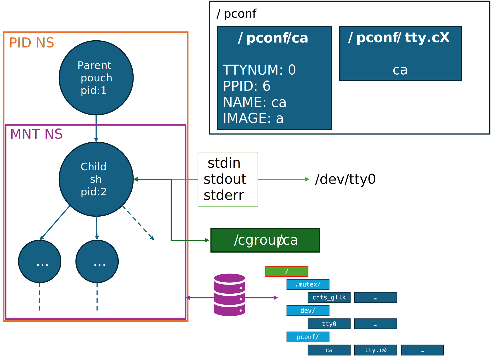
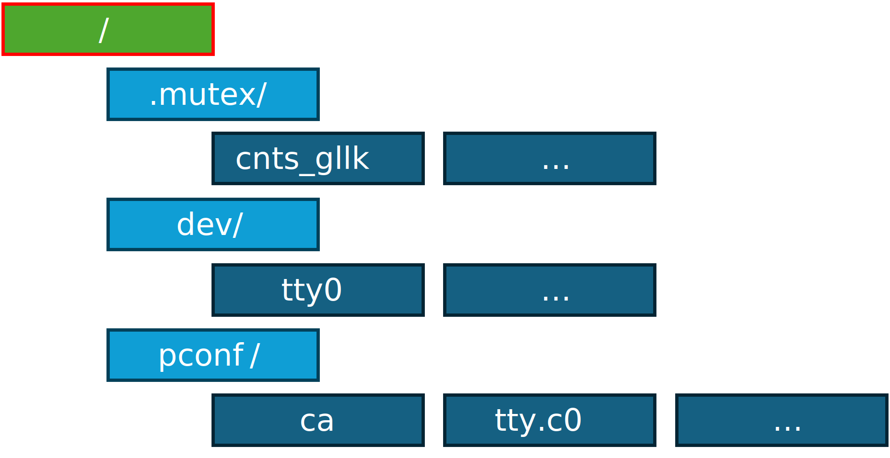

# Containers - Pouch
## TTY Devices
Upon xv6 boot 3 tty devices are created with `mknod` syscall during `init`. They're all created under the `/dev/` directory (named `ttyX`, with X set to 0, 1 or 2), and all devices are controlled by the same device driver and have a common major device number. 
The major number is the offset into the kernel’s device driver table, which tells the kernel what kind of device driver to use. The minor number tells the kernel special characteristics of the device to be accessed. 
We can recognize each device by its major number (which identifies the driver and devices class) and by minor number which identifies the device itself. In other words every device driver is identified by ordered pair `major:minor`.

As it was mentioned already 3 tty devices were added. Tty devices are initialized in `main.c` by `ttyinit()`. 

`ttywrite()` and `ttyread()` functions are wrappers of the existing `consoleread()` and `consolewrite()` functions. They implement actual writing and reading to the user terminal for the tty that is active at the moment. `flags` property added to `devsw` to support different operations on tty devices.

Operations on tty devices were defined in `fcntl.h` and the corresponding functions are implemented in `tty.c`, and can be listen in `fcntl.h`:
```c
// ioctl tty command types
#define DEV_CONNECT 0x1000
#define DEV_DISCONNECT 0x2000
#define DEV_ATTACH 0x0010
#define DEV_DETACH 0x0020

// ioctl tty requests types
#define TTYSETS 0x0001
#define TTYGETS 0x0002
```
The `ioctl` syscall was added to control tty devices allowing to connect / disconnect / attach / detach tty devices as long as to set/get their properties.

## Configuration Files
Containers in xv6 are identified by name (at least on this stage). The identifier name is used for a container specification by (almost) all the commands that pouch utility supply. pouch stores all it's configurations and state in the `/pouch` directory. 

Every container started with the pouch utility has a file names `/pconf/<name>` where the `<name>` corresponds to the container identification string as it was specified at the container creation stage. This file contains multiple lines with the configuration of the container, including what tty device is attached to the container, what is the PID of the process that forked the shell running inside the container, the container's name and the container's image name. For example, running the `pouch start ca a` command right after system startup, results in the following contents of the `/pconf/ca` file:
```
TTYNUM: 0
PPID: 6
NAME: ca
IMAGE: a
```

Additionally, `/pconf/tty.c[0-2]` files specify a container identification string of the container that is tied to the corresponding tty device. If no container is tied to the tty device, the file is empty. Hence, listing the `/pconf` directory after the above command results in the following:
```sh
$ ls /pconf
.              1 44 96
..             1 1 1024
tty.c0         2 45 2
tty.c1         2 46 0
tty.c2         2 47 0
ca             2 55 36
```
The contents of the `/pconf/tty.c0` file are:
```sh
$ cat pconf/tty.c0
ca$
```
and the contents of the `/pconf/tty.c1` and `/pconf/tty.c2` files are empty.

## Cgroup usage
Processes running inside xv6 containers are organized by the pouch utility in a flat cgroup hierarchy. Pouch mounts the cgroup fs on the `/cgroup` mount point, creates a directory `/cgroup/name` for a container identified by the name identification string and takes advantage of the cgroups mechanism control means to allocate resources for the processes running inside the container. The directory is removed from the croup hierarchy when the container is destroyed. Pouch utility is limiting the container hierarchy to be flat i.e nesting is not supported. The layout of `/cgroup` is depicted on below in continuation of the previous example (`ca` cgroup for the `ca` container):
```sh
$ ls /cgroup
.                                                                5 512
cgroup.procs                                                     4 9
cgroup.max.descendants                                           4 2
cgroup.max.depth                                                 4 2
cgroup.stat                                                      4 60
ca                                                               5 448
```
And the contents of the `/cgroup/ca` directory are:
```sh
$ ls /cgroup/ca
.                                                                5 448
..                                                               5 512
cgroup.procs                                                     4 2
cgroup.controllers                                               4 6
cgroup.subtree_control                                           4 3
cgroup.events                                                    4 13
cgroup.freeze                                                    4 0
cgroup.max.descendants                                           4 2
cgroup.max.depth                                                 4 2
cgroup.stat                                                      4 60
memory.current                                                   4 25
cpu.stat                                                         4 0
memory.stat                                                      4 0
io.stat                                                          4 0
cpu.weight                                                       4 0
cpu.max                                                          4 0
```

The `pouch info` command provides additional information, that is queried from the cgroup of the container specified -- for example, the `cpu.max` and `cpu.stat` categories the the `cgroups` section of the `pouch info` command output are taken from the cgroup filesystem of the container (under `/cgroup/<name>`).
Additionally, the `pouch cgroup` command allows setting a resource limit for a container, by writing to the cgroup filesystem of the container -- for example, to limit the CPU usage of a container, the user can run `pouch cgroup cpu.max 50 <name>` to limit the container to 50% of the CPU, the command actually writes to the `/cgroup/<name>/cpu.max` file the value `50`, as specified by the cgroups' interface (the cgroup filesystem).

## Pouch images
Images in xv6 are stored in the `/images/` directory. An xv6 pouch image is a native FS image that contains the root filesystem of the container -- like `internal_fs_a[a-c]`. Pouch looks up available images by listing the files in the `/images/` directory, and currently, the way of "importing" an image to pouch is by copying it to the images directory. The name of an image -- is the name of the file that contains the image. 
For example, importing an image manually can be performed by copying the `internal_fs_a` file to the `/images/` directory:
```sh
$ pouch images
No images available.
$ ls /images/
.                                                                1 40 48
..                                                               1 1 1024
$ cp internal_fs_a images/img_a
$ pouch images
Pouch images available:
img_a
$ ls /images/
.                                                                1 40 48
..                                                               1 1 1024
a                                                                2 42 16384
$ rm /images/img_a
$ pouch images
No images available.
$ ls /images/
.                                                                1 40 48
..                                                               1 1 1024
```

## Container startup process
The container startup process is the core of the pouch utility -- starting a container allows the user to interact and practically use most of the kernel's features, such as namespaces and cgroups, to create an isolated environment. The `pouch start` command is used to start a container from the specified image by the user.
Let's review the startup process of a container, when, for example, running the `pouch start ca a` command.
The first function called from the command line is the 
```c
pouch_status pouch_do_container_start(const char* container_name,
                                      const char* const image_name);
```
This function constructs an instance of the following struct, that is used to configure the container in the internal container startup process:
```c

/**
 * Defines properties to start a container.
 */
struct container_start_config {
  char image_name[MAX_PATH_LENGTH];
  char container_name[CNTNAMESIZE];

  /** Specifies the type of container to be started. */
  bool daemonize;

  /** Specifies mounts to apply when starting the container. */
  const struct container_mounts_def* mounts;

  /** Called in the context of the container's child process after it has
   * started. */
  pouch_status (*child_func)(const struct container_start_config* config);

  /**
   * Data to be used by different users of the container start,
   * to be passed from the caller to child and parent functions.
   */
  void* private_data;

  /** The mount point of the container image.
   * This is filled in by the container start function.
   */
  char image_mount_point[MAX_PATH_LENGTH];
};
```

This struct contains common configuration that may be changed between usages of the internal function, that actually performs the build:
```c
pouch_status _pouch_container_start(struct container_start_config* const info);
```
The abstraction will be clearer once the `pouch build` command implementation explanation is further provided, later.
The process of starting a container is as follows:
1. The global pouch mutex is locked to avoid race conditions (over images and configuration files).
2. A free TTY device is located and assigned to the container to be started. 📝 `daemonize`
3. Image existence and container name availability are checked.
4. The `tty.cX` configuration file is filled with the new container name. 📝 `daemonize`
5. A New process is created to allow the container parent process to be included in the container's PID namespace. 📝 `daemonize`
6. A PID namespace is created for the container. 
7. The container child process is forked and waits for a notification from the parent process to continue.
8. The container's parent process sets up the mounts for the container.
9. The container's parent process creates the container configuration file `/pconf/<name>` and fills it with the container's configuration.
10. The child process is notified to continue.
11. The child process creates a new mount namespace.
12. The child process calls `pivot_root` to change the root filesystem to the container's image, followed by a `chdir` to `/`.
13. The parent process is notified to umount the created mounts from stage #8 outside of the container.
14. The child process umounts the old root filesystem from inside of the container.
15. The child process attaches the TTY device to the TTY of the container. 📝 `daemonize`
16. The child process calls the `child_func` function from the `container_start_config` struct, and exits with it's return value.
17. The parent waits for the child to complete & cleans up (using `_pouch_container_stop`) IFF the `daemonize` flag is not set. 📝 `daemonize`
18. The global pouch mutex is unlocked.

_* 📝  indicates that this is optional, depending on the configuration struct by `info`_

A simple diagram that shows the components of a running pouch container, that the user started by using the `pouch start` command, is shown below:



Running `pouch start` command calls the `pouch_do_container_start`, which in it's turn, calls the `_pouch_container_start` function with the following configuration struct:
```c
struct container_start_config info = {.child_func = pouch_start_child_func,
                                        .mounts = pouch_start_mounts,
                                        .daemonize = true,
                                        image_name = ...,
                                        container_name = ... }
```
- `daemonize` is set to true, as the user would like to run the container in the background, according to the start command's spec.
- `child_func` is set to `pouch_start_child_func`, which is a function that is called by the child process after it has started and configured. this function simply calls `exec("/sh")` to start a shell in the container, so the user can interact with it.
- `mounts` is set to `pouch_start_mounts`, which is an array of mounts that are performed when starting a container, that are explained properly below.
- The `image_name` and `container_name` fields are set to the image name and container name specified by the user in the `pouch start` command.

### Daemonize
The daemonize option in the configuration is used to indicate whether the user would like to run the container in the background or whether they would prefer waiting for the container's destruction while watching it's output in the foreground. 
this configuration option is true when running `pouch start`. In other use cases, the user may want to run the container in the foreground, for example, when running `pouch build`.

How does it effect the startup process?
* No tty is required to be attached to the container.
* The parent process waits for the child process to complete, and the child process is not forked.

The above diagram refers to the case where daemonize is set to true -- the diagram shows that the container's child process (and it's descendants) have their `stdin`, `stdout` and `stderr` redirected to the `/dev/tty0` device.

### Mounts
When the parent runs, it sets up the filesystem for the new container (#8). This is performed using the call for the:
```c
static pouch_status pouch_container_mount(
    const struct container_start_config* config);
```
function. This function uses the `mounts` field of the `config` parameter to determine what mounts to perform, and in which directory (and order) they should be put when building the filesystem for the new container. Each struct in the `mounts` array contains the following fields:
```c
enum container_mount_type { IMAGE_ROOT_FS = 1, BIND_MOUNT, LIST_END };
/**
 * Defines a mount to be used in a container.
 */
struct container_mounts_def {
  const char* src;
  const char* dest;
  enum container_mount_type type;
};
```
The `type` field specifies what type of bind should be performed -- bind mount or image root filesystem mount. Technically, 
- image root filesystem mounts are mounts from the image's root filesystem to the container's root filesystem. Therefore, the mount that is performed is a nativefs mount (using the loop device based on the image file specified -- a pouch image is just a file that contains a filesystem!). The `src` parameter is ignored, because the image is specified in the `container_start_config` struct, and the `dest` field is the path to the destination directory, inside the container, relative to the container's root filesystem. It should be empty for the root filesystem mount, as the root filesystem is mounted to the root of the container's filesystem.
- bind mounts are regular bind mounts from the outside of the container to it's inside (that's why we perform the mounts outside of the container -- so they won't get lost when `pivot_root` is called!). In this case, the `src` field is the path to the source directory, outside of the container, and the `dest` field is the path to the destination directory, inside the container, relative to the container's root filesystem.

Let's look at the `static const struct container_mounts_def pouch_start_mounts[]` array of mounts defined in `start.c`:
```c
/**
 * Mounts configuration for pouch start container command.
 */
static const struct container_mounts_def pouch_start_mounts[] = {
    // Mount root filesystem first, and umount it last.
    {
        .src = NULL,
        .dest = "",
        .type = IMAGE_ROOT_FS,
    },
    // Pouch configuration & dev directories are required to allow pouch to
    // work.
    {
        .src = DEV_DIR,
        .dest = DEV_DIR,
        .type = BIND_MOUNT,
    },
    {
        .src = POUCH_CONFIGS_DIR,
        .dest = POUCH_CONFIGS_DIR,
        .type = BIND_MOUNT,
    },
    // Mutex directory is needed for mutexes to work across containers.
    {
        .src = MUTEX_PREFIX,
        .dest = MUTEX_PREFIX,
        .type = BIND_MOUNT,
    },
    {.type = LIST_END}};
```

Running `pouch start ca a` will result in the following mounts **outside** the container, created by the parent before the child is allowed to continue:


* The red-bordered rectangle will be the new container's root filesystem. A loop device is used to mount the image file `/images/a` to that directory.
* The green-bordered rectangles are the bind mounts that are performed outside of the container, but will be available inside the container. The diagram shows the targets of those bind mounts. The files under the bind mounts _targets_ are not shown in the diagram, but they are the same as the files under the bind mounts _sources_ (an `ls` command on the source directories will show the same files as an `ls` command on the target directories).

Once `unshare(MOUNT_NS)` is called by the child, the entire mounts structure is copied to the child's mount namespace. The child performs `pivot_root` to `/mnt/ca` & `umount(/.old_root)` so from the child's perspective, the filesystem looks like this:


The colors of the rectangles were preserved from the diagram above. The parent umounts the mounts it created outside of the container, but thanks to the mount namespace creation, the mounts are still available inside the container. The child umounts the old root filesystem, and the container is ready to run!
As long as the bounded directories are not removed from their filesystems, the container will be able to access them.

## Container stop process
The stop process is simpler than the startup process, and performs some of the opposite steps to the ones during startup, just in reversed order, in the function:
```c
pouch_status _pouch_container_stop(const container_config* const conf);
```
The destruction steps are as follows:
1. The global pouch mutex is locked
2. The container is removed from it's cgroup and the container's PID is killed, if still alive. 📝 `daemonize`
3. The container's configuration file is removed from `/pconf/<name>`.
4. The container's cgroup is removed.
5. The container's `/pconf/tty.cX` file is emptied. 📝 `daemonize`
6. The container's tty device is released. 📝 `daemonize`

_* 📝  indicates that this is optional, depending on the configuration struct by `info`_

Looking at the diagram of a running container above, we can clearly see every resource that is consumed by a running container, and the destruction steps above show how the container is stopped and all the resources are released:
- ✅ The container's PID is killed, so the container's processes are stopped (2);
- ✅ The container's configuration files (`/pconf/<name>` + `/pconf/tty.cX`) are removed (3, 5);
- ✅ The container's cgroup is removed (4);
- ✅ The container's tty device is detached and released (6).
- ✅ The PID and mount namespaces are destroyed when the container's PID is killed -- they are all ref-counted, and the namespaces are destroyed when the last process that uses them exits.

The `_pouch_container_stop` function is sometimes called by the parent process, when daemonize is `false` -- that is, because we have already waited for the child process to complete, and the parent process is the calling process to this function -- so there is not child process to kill. Additionally, TTYs are not used, so there is no need to release any of them.

## Image building process
Mentioned above are the many abstractions and options included in the `_pouch_container_start` function, that are used to start a container. Those abstraction were added as a part of the image building command implementation, to allow running containers in multiple configurations. The purpose of this abstraction will become clear as the build process is described below.

First, the pouchfile is read and parsed by the `pouch_build_parse_pouchfile` function, and it is validated to ensure that it is a valid pouchfile, according to the pouchfile specification. Then, the pouchfile is passed to the `pouch_build_execute` function, which is responsible for executing the commands specified in the pouchfile, and building the image. What are the main steps of executing the image build?
1. The source image `IMPORT <IMAGE_NAME>` is deep-copied to an image named after the requested tag.
2. A container is started with an internal configuration for building the image, and with the new image from stage (1) mounted as the root filesystem.
3. Code is executed inside the container to build the image -- by executing `RUN` and `COPY` commands as specified in the source pouchfile. 
4. The build container shuts down, and the new image is ready to be used.

In any case of error, the copied image from stag (1) is removed, and the build container is shut down.

### Build container configuration
What configuration is used to start the build container? The configuration is specified in the `pouch_build_execute` function:
```c
struct container_start_config config = {
    .daemonize = false,
    .child_func = pouch_build_container_child,
    .mounts = build_mounts,
    .private_data = (void*)pouchfile,
};
```

- `daemonize` is set to false, as the user would like to run the container in the foreground, seeing the output of the build process, and wait for the build to complete and container to exit.
- `private_data` is set to the parsed pouchfile structure, so the build child function can access the parsed pouchfile and execute the commands specified in it.
- `child_func` is set to `pouch_build_container_child`, When the build container starts, it calls the child function `pouch_build_container_child`, which is responsible for executing the commands specified in the pouchfile. It gets the parsed pouchfile as a parameter, and it starts executing the commands one-by-one, in order.
- `mounts` is set to `build_mounts`. This array contains a similar mounts definition to the one used in the `pouch start` command, but it does not include the `/dev/` and `/pconf/` mounts, as `pouch` should not be used inside the build container. For the `COPY` command, an additional bind mount is added, as explained below.

### IMPORT command
The imports command is implemented in the first step mentioned above of the build execution. The source image is copied from the `/images/` directory to the `/images/` directory, with the new name specified in the `IMPORT` command. From this point, the new image is used as the root filesystem for the build container, it is edited as the build container runs, and so the changes are applied to the new image file in-place, and once the build is complete, the new image is ready to be used, and contains all the changes made during the build process by the `RUN` and `COPY` commands.

### RUN command
For `RUN` commands, it calls `system()` with the specified command provided as argument to the `RUN` command call. For example, if the pouchfile contains the command `RUN echo "Hello, World!"`, the child function will call `system("echo \"Hello, World!\"")` to execute the command in the container.

### COPY command
For `COPY` commands, it copies the specified file from the host filesystem to the container's filesystem, using the utility `cp` function. The `COPY` command is currently able to copy those files thanks to the bind mount added for the build process:
```c
static struct container_mounts_def build_mounts[] = {
    ...
    // Add build directory to the container so it can execute COPY commands.
    {
        .src = "/",
        .dest = BUILD_BIND_DIR,
        .type = BIND_MOUNT,
    },
    ...
};
```
This mount binds the root outside the container to the `BUILD_BIND_DIR` -- `/.build` directory inside the container. This bind mount provides full access to the host filesystem from the container, so the `COPY` command can copy files from the host filesystem to the container's filesystem easily. During the teardown of the build container, the `BUILD_BIND_DIR` is umounted and removed, so all the files under the `/.build` directory are completely removed from the final image.
For example, if the pouchfile contains the command `COPY myfile`, the child function will call `cp("/.build/myfile", "myfile")` to copy the `/myfile` file from the host filesystem to the container's filesystem root directory, to the `/myfile` file inside the container.

## Connect/Disconnect to a container
Is done by the `pouch [dis]conect [name]` commands. These command simple look up the tty's id by the container name, open the tty device and perform the `ioctl` syscall via `tty_connect()` and `tty_disconnect()` function in the user library.

## Pouch info & list
Those commands read the configuration files under the `/pconf/` directory to list the available containers and examine their properties as set in the configuration files (as mentioned above). 
