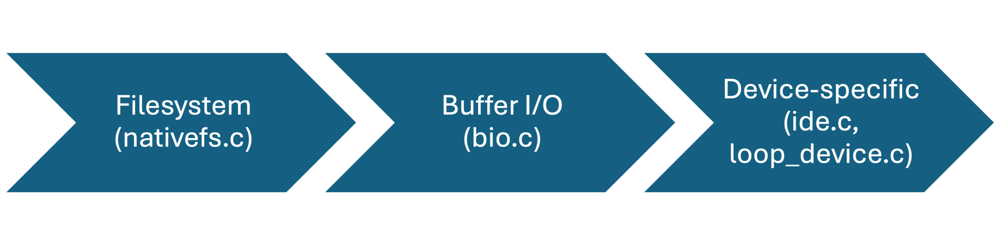

# VFS, Devices & Mounts

## Devices
Currently, xv6 supports 3 types of devices (as specified by the `enum device_type`):
```c
enum device_type {
  DEVICE_TYPE_NONE = 0,
  DEVICE_TYPE_IDE,
  DEVICE_TYPE_LOOP,
  DEVICE_TYPE_OBJ,

  DEVICE_TYPE_MAX
};
```

There is currently a single implemntation of an abstract device struct in xv6, that is used to represent all devices of all types in the system.
The device struct is defined as follows:
```c
struct device {
  int ref;
  int id;
  enum device_type type;
  void* private;
  const struct device_ops* ops;
};

struct device_ops {
  void (*destroy)(struct device* dev);
};
```

- The `id` of a device is a global identifier of the device, that is unique across all the devices.
- The `type` specified the device type.
- The `private` field may be used by the device's implementation to store any device-specific data. This is explained further in each device's implementation.
- The `ops` field is the vtable of the device, currently allows the destruction of the device once it's ref count reaches 0.

All the devices in the system are held in a glboal `dev_holder` struct instance:
```c
struct dev_holder_s {
  struct spinlock lock;  // protects loopdevs
  struct device devs[NMAXDEVS];
  uint devs_count[DEVICE_TYPE_MAX];
};
```
- The `devs` is an array of device structs, described earlier.
- The `devs_count` is an array of counters, that count the number of allocates devices of each type in the system.
### Block I/O
The block I/O in xv6 is split to multiple modules, and is used by the native fs only. The `native_fs.c` module mainly uses `bio.c` to access the block devices -- perform read and write operations on them. The `bio.c` calls device-specific functions (partially -- as explained for each device), to access the blocks for reading and writing using the device-specific implementation.

The following chart describes the Block I/O architecture in xv6:


#### IDE Device
Is implemenetd in the `ide_device.c` file. IDE is an interface for hard disks (block devices), and it is currently assumed that only one IDE device is connected to the system at any given time, and that this device is the disk, attached to the root of the root mount namespace (that is used for `init` when the system starts up).
The device uses the `->private` field to store the IDE port, that is used to access the device by the IDE driver (`ide.c`, via calls from `bio.c`).
Since there is a single, non-destructible instance of an IDE device, it's ops are currently set as the default ops.

The first IDE device is created when the kernel's `main` calls `devinit()`. The `devinit()` function initializes the `dev_holder` struct, the buffer cache layer, the IDE driver, and finally, it creates the root IDE device by calling `create_ide_device()`, that perform the fields initialization as mentioned above. The first IDE device is accessed via `mntinit()` when mounting the root filesystem, and it is passed to the nativefs module.

#### Loop Devices
Loop devices are block devices (similar to an IDE device), that use a file as the data holder for the device. This is used in xv6 for the `internal_fs_[a-c]` images mounting, as well as for the impleemntation of root filesystems for pouch containers (that are loop devices which we mount and `pivot_root` to).

Loop devices are implemented in `loop_device.c`. 
- The loop devices implemntation currently use the `device->private` field to store the in-memory inode that backs up the data of the device -- the inode for the `internal_fs_[a-c]`, for that matter. 
- The `destory_loop_dev()` is incoked once a loop device has reached a ref count of 0, and it's inode is released.
- The current `bio.c` -- the block I/O interface supports loop devices by calling the functions `getinodefordevice()/doesbackdevice()` when performing operation against devices, that are requested by the filesystems, using those devices. *

Loop devices are created when mounting a "nativefs" mounts by the user (via `handle_nativefs_mounts()`). This function gets or creates a loop device for the specified inode -- if the inode already attached to an existing loop device, the loop devices is references and used for the mount, so no 2 loop devices are created for the same inode!

_* This implemntation may need a modification in the future, by creating another abstraction of `block_device` that reveals `read` & `write` operations, such as that checking whether is device a block device or not for each `bio.c` FS-used function is not needed inline, but rather is set on initialization of that device. This is partially done for ide (`ide.c`)_

### Object I/O
Are explained further in the objfs documentation.
Briefly, the entire logic of the object devices is implemented in the `obj_disk.c` module -- the `init_obj_device` function fills the `->private` and `->ops` fields of the device structure. The logic, that is split for the block I/O across `bio.c`, `loop/ide_device.c` and `ide.c` is all implemented in a single module. That is okay, since there is only a single type of object device.

## VFS
A virtual filesystem mechnism is implemented in the XV6 kernel, and is similar with some set of the features that are contained in the linux virtual filesystem interface. The current implementation of the VFS only contains inode, file and superblock abstractions, and it misses some abstractions such as the dentry.
### inode
_This section is missing, and may be added in the future._
### file
_This section is missing, and may be added in the future._
### superblock
The superblock in the VFS is a struct that holds the information about the filesystem that is currently mounted. This struct is allocated when mounting a filesystem, and is freed when unmounting it, because it represents the filesystem instance.
The `vfs_superblock` struct is defined as follows:
```c
struct sb_ops {
  struct vfs_inode *(*ialloc)(struct vfs_superblock *sb, file_type type);
  struct vfs_inode *(*iget)(struct vfs_superblock *sb, uint inum);
  void (*start)(struct vfs_superblock *sb);
  void (*destroy)(struct vfs_superblock *sb);
};

struct vfs_superblock {
  int ref;
  struct spinlock lock;
  void *private;
  const struct sb_ops *ops;
  struct vfs_inode *root_ip;
};
```
- The `ref` field is the reference counter of the superblock, that is used to determine whether the superblock is still in use or not. When the ref counter reaches 0, the superblock is destroyed. `sbdup` and `sbput` functions are used to increase and decrease the ref counter. As exaplined later, ref==1 is required for umount to succeed.
- The `private` field is used by the filesystem implementation to store any filesystem-specific data.
- The `ops` field is the vtable of the superblock, that holds the functions that are used to interact with the filesystem. This field is of type `struct sb_ops`, and it includes the following struct members:
    - `ialloc` - allocates a new inode in the filesystem.
    - `iget` - gets an inode by its number. It can be removed in the future, as it is not used through the VFS interface, and may be called in FS-specific modules only.
    - `start` - starts the filesystem. This function is called when the filesystem is mounted, and it exists due to the current kernel initialization process.
    - `destroy` - destroys the superblock -- the filesystem instance. This function is called when the filesystem is unmounted (=ref reaches 0).

The following functions are currently defined for the superblock:
```c
struct vfs_superblock* sballoc();
void sbdup(struct vfs_superblock* sb);
void sbput(struct vfs_superblock* sb);
```
- `sballoc` allocates a new superblock, and initializes it with the default values.
- `sbdup` increases the ref counter of the superblock.
- `sbput` decreases the ref counter of the superblock. If the ref counter reaches 0, the superblock is destroyed.

Currently, the superblock abstraction is only used in the nativefs and the objfs filesystems, and it is not used for pseudo filesystems, such as the procfs and the cgroupfs. The main reason for implementing the superblock abstraction is to allow the filesystems to have a common interface, prevent a direct access to the filesystem-specific data, and to allow the filesystems to be mounted and unmounted dynamically and properly using the safely implemented and well tested VFS interface, that is also used by the nativefs and the objfs filesystems.

## Mounts
The xv6 kernel supports 2 main types of mounts: bind mounts and filesystem mounts. The mount struct is defined as follows:
```c
struct mount {
  /* Pointer to the parent mount, if any. */
  struct mount *parent;
  /* Pointer to the mount point in the filesystem through which the mount is
   * accessible. */
  struct vfs_inode *mountpoint;
  /* Reference count. */
  int ref;

  /* Whether this is a bind mount. */
  bool isbind;

  union {
    /* Associated mounted FS superblock. Used if !isbind. */
    struct vfs_superblock *sb;
    /* Associated inode, applicable only for bind mounts. Used if isbind. */
    struct vfs_inode *bind;
  };
};
```
Let's explain the fields of the mount struct:
- `parent` - a pointer to the parent mount. This field is used to create a mount tree, where each mount has a parent mount, except for the root mount, which has no parent (and its parent field is `NULL`). It is used in the `vfs_namex` function to implement looking up the `..` directory, as explained later.
- `mountpoint` - a pointer to the inode that represents the mount point in the filesystem of the parent mount, that the mount is accessible through. For example, when mounting `internal_fs_a` on the `/a` directory right after system startup, this field will hold a pointer to the `/a` inode on the root filesystem (the disk).
- `isbind` - a boolean field that indicates whether the mount is a bind mount (`isbind=true`) or a filesystem mount (`isbind=false`). The `isbind` field is used to determine which field of the union to use.
- Mount target union:
    - `sb` - a pointer to the superblock of the mounted filesystem. This field is used when the mount is a filesystem mount.
    - `bind` - a pointer to the inode that is mounted. This field is used when the mount is a bind mount.

Mounts are allocated in the global:
```c
struct mount_list {
  struct mount mnt;
  struct mount_list* next;
};

struct {
  struct spinlock mnt_list_lock;  // protects mnt_list
  struct mount_list mnt_list[NMOUNT];
} mount_holder;
```
instance. The `mnt_list` array holds the mounts, and the `next` field is used to create a linked list of mounts (that are used for the mount namespaces). The `mnt_list_lock` spinlock is used to protect the `mnt_list` array from concurrent access.

### Mount creation
The very first mount initialization for xv6 is done through `mntinit()` in the kernel `main()` function. This function initializead the spinlock, but more importenetly, it mounts the root IDE device to a first root mount, that is used in the root mount namespace as the root, and allocates a nativefs filesystem on this mount (since the disk is assumed to always be a nativefs filesystem). The following function is used through every mount flow:
```c
static int addmountinternal(struct mount_list *mnt_list, struct device *dev,
                            struct vfs_inode *mountpoint, struct mount *parent,
                            struct vfs_inode *bind, struct mount_ns *ns)
```
it's purpose is to fill `mnt_list->mnt`'s values with the correct values according to the mount type, to allocate superblock and initialize filesystem (without starting it -- **no call to `->start` is made**), and to insert `mnt_list` to the `ns->mnt_list` list.
In the root mount flow when the kernel starts, this function is called with the root IDE device, the root mountpoint inode, and the root mount namespace. The important part is that the filesystem start is possibly done by using some process-context-requiring functions (at the time of this implemntation, sleep locks were widely in use for the buffered I/O layer that is required for reading the superblock from the disk -- a crucial part in the filesystem intialization!). Since the first root mounting of the disk native filesystem is called throught the kernel's main function, before any process is created (also, the `init` process cannot be created without having any `cwd` inode and `cwdmount` to work with preroply), it has to be done outside of any process context, and hence, the filesystem start is not called in this function.
The final initialization of the filesystem is performed through the `init`'s kernel-mode callback on creation (`forkret`, `if (first)`), before any user code runs, and in that point the `->start()` function is called on the superblock.

The other flow that calls the above function is the via the `mount` syscall flow. it's called via the folloiwing function, that is the handler for all the mount syscalls:
```c
int mount(struct vfs_inode *mountpoint, struct device *target_dev,
          struct vfs_inode *bind_dir, struct mount *parent);
```
This function performs extra assertions on the input parameters, determines what namespace is to be used, makes sure the mount is not intended to be installed on an existing mount (no two mounts on the same mountpoint for the same parent), it calls the `addmountinternal` function, but also starts the filesystem by calling `->start` on the superblock ops, if the previous call was successful, and if it is not a bind mount.

## Path lookup
The `vfs_namex` function is used to look up a path in the filesystem, and return it's inode, mount, or parent mount/inode. It is mentioned here since it combines a heavy usage of both the mounts and the VFS inode operations, and it's function is crucial for the filesystem operations in the kernel, as well as for the security and isolation mechanisms.
Let's review the `vfs_namex` function's algorithm to better understand how all the components are used together:

- Begin by setting up the initial inode and mount to begin the lookup from:
    - If path started with `/`, set the initial inode to the root inode, and the mount to the root mount -- _of the current namespace_.
    - Else, use the current process's `cwd` inode and `cwdmount` mount.
- As long as there is an additional path component to process, `component`:
    1. If this is the last component in the path and a parent was requested, return the current mount and inode.
    2. Call the `dirlookup` function on the current inode, with the `component` as the name, starting with offset 0, and set the result to the `next` inode.
    3. If the `dirlookup` function returned an error, return `NULL`.
    4. If the current lookup was from the current mount's root inode, and it was for the "..", and the current mount is not the root mount, perform the ".." lookup on the `mnt->parent->mountpoint` inode and set it to `next`, and set the current mount to the parent mount.
    5. Otherwise, check if the current looked-up directory is a mount point in the current mount namespace. If it is, set the current mount to the mount that is associated with the mount point inode, and set the `next` inode to the mount's root inode.
    6. Repeat the loop with the `next` inode as the current inode.

Note that:
1. The usage of the `mnt->parent->mountpoint` inode is used to implement the `..` lookup, and it is used to traverse the mount tree.
2. The lookup for mounts is namespace-dependent -- from the root mount of the current namespace (in the beginning) to the mount point in the filesystem (5).
